# Proyecto 1 - MLOps: Pipeline de Datos, Entrenamiento e Inferencia


---

## Descripcion General

Este proyecto implementa un pipeline completo de MLOps sobre el dataset **Covertype**: desde la ingesta de datos hasta la inferencia en produccion. El sistema soporta **dos flujos de entrenamiento** con distintas filosofias, ambos compartiendo la misma infraestructura de servicios y la misma API de inferencia.

> **Requisitos de hardware recomendados:** minimo 8 GB de RAM y 10 GB de espacio en disco libre. El stack completo (Airflow + MySQL + MinIO + Redis + PostgreSQL + APIs) puede consumir 6-8 GB de RAM en ejecucion.

---

## Tabla de Contenidos

1. [Arquitectura de Servicios](#arquitectura-de-servicios)
2. [Flujos de Entrenamiento](#flujos-de-entrenamiento)
3. [DAG: data_dag](#dag-data_dag)
4. [Componentes en Detalle](#componentes-en-detalle)
5. [Como Ejecutar el Proyecto](#como-ejecutar-el-proyecto)
6. [Flujo Completo de Prueba](#flujo-completo-de-prueba)
7. [Decisiones de Diseno](#decisiones-de-diseno)
8. [Troubleshooting](#troubleshooting)
9. [Dataset: Covertype](#dataset-covertype)
10. [Tecnologias Utilizadas](#tecnologias-utilizadas)

---

## Arquitectura de Servicios



| Servicio            | Descripcion                                                                                             |
| ------------------- | ------------------------------------------------------------------------------------------------------- |
| **Data API**        | FastAPI que simula la fuente externa de datos. Sirve el dataset Covertype en 10 batches cada 5 minutos |
| **Apache Airflow**  | Orquestador. Ejecuta el DAG de ingesta y preprocesamiento                                               |
| **MySQL**           | Almacena datos crudos (`covertype_raw`) y datos preprocesados (`covertype_cleaned`)                     |
| **MinIO**           | Almacenamiento de objetos compatible con S3. Guarda preprocesadores y modelos entrenados                |
| **Model Training**  | JupyterLab con acceso a MySQL y MinIO para ejecutar los notebooks de entrenamiento                      |
| **Inference API**   | FastAPI que expone endpoints v1 y v2 para prediccion usando modelos almacenados en MinIO                |
| **PostgreSQL**      | Base de datos interna de Airflow (metadatos, estado del DAG)                                            |
| **Redis**           | Broker de mensajes para el Celery Executor de Airflow                                                   |

---

## Flujos de Entrenamiento



El proyecto implementa dos flujos con filosofias distintas pero complementarias, diferenciados por la version (`v1` / `v2`) tanto en MinIO como en la API de inferencia.

---

### Flujo V1 — Preprocesamiento Estandarizado (train2.ipynb)

```
Data API → DAG → MySQL (raw + cleaned) → MinIO (v1/preprocess/) → train2.ipynb → MinIO (v1/models/) → Inference API /v1/*
```

**Como funciona:**

1. El DAG recolecta todos los batches de la Data API y los guarda en `covertype_raw` (datos crudos).
2. Una vez completa la ingesta, el DAG ejecuta el preprocesamiento: limpieza, escalado, one-hot encoding, y divide los datos en train/test (80/20). El resultado se guarda en `covertype_cleaned` y el preprocesador entrenado se sube a MinIO en `v1/preprocess/preprocessor.joblib`.
3. El notebook `train2.ipynb` asume que estas tablas y el preprocesador ya existen. Lee los datos directamente desde `covertype_cleaned` (ya transformados) y descarga el preprocesador desde MinIO para asegurar consistencia con el pipeline de produccion.
4. El modelo entrenado se sube a MinIO en `v1/models/{nombre_modelo}.joblib`.
5. La Inference API expone `/v1/predict`: usa siempre el mismo preprocesador del DAG (`v1/preprocess/preprocessor.joblib`) y el modelo solicitado desde `v1/models/`.

**Ventajas:**
- **Consistencia garantizada**: el mismo preprocesador que transformo los datos de entrenamiento es el que se usa en produccion. No hay riesgo de divergencia entre entrenamiento e inferencia.
- **Eficiencia**: los datos ya estan preprocesados en MySQL; el notebook solo entrena, sin repetir el preprocesamiento.
- **Estandarizacion del pipeline**: todos los modelos v1 comparten un unico preprocesador, facilitando comparacion justa entre modelos.
- **Reproducibilidad**: cualquier cientifico de datos que ejecute `train2.ipynb` obtiene exactamente el mismo punto de partida.
- **Menor tiempo de experimentacion**: se puede entrenar y comparar multiples modelos sin volver a procesar los datos.

---

### Flujo V2 — Preprocesamiento Flexible por Modelo (train.ipynb)

```
Data API → DAG → MySQL (raw) → train.ipynb → MinIO (v2/preprocess/ + v2/models/) → Inference API /v2/*
```

**Como funciona:**

1. El DAG recolecta los batches y guarda los datos crudos en `covertype_raw`. No es necesario esperar al preprocesamiento del DAG.
2. El notebook `train.ipynb` lee directamente desde `covertype_raw`, construye su propio pipeline de preprocesamiento (puede variar segun el modelo o experimento) y lo ajusta con los datos de entrenamiento.
3. Tanto el modelo como su preprocesador se suben a MinIO bajo el mismo nombre: `v2/models/{nombre}.joblib` y `v2/preprocess/{nombre}.joblib`.
4. La Inference API expone `/v2/predict`: carga el preprocesador y el modelo por nombre, de modo que cada modelo tiene su propio preprocesamiento asociado.

**Ventajas:**
- **Flexibilidad total**: el cientifico de datos puede experimentar con diferentes estrategias de preprocesamiento (distintas features, distintos escaladores, distintos encoders) sin afectar otros modelos.
- **Autonomia del notebook**: no depende del estado del DAG ni de la tabla `covertype_cleaned`; basta con tener datos crudos.
- **Experimentacion rapida**: ideal para iterar sobre hipotesis de preprocesamiento y ver su impacto en el rendimiento del modelo.
- **Modelos autosuficientes**: cada modelo v2 lleva su propio preprocesador, lo que facilita el versionado y el despliegue independiente de cada experimento.
- **Adaptabilidad**: permite ajustar el preprocesamiento a las particularidades de cada algoritmo (por ejemplo, SVM vs Random Forest pueden beneficiarse de distintos escalados).

---

## DAG: `data_dag`


Orquestado por Airflow, se ejecuta cada 5 minutos y sigue este flujo:

```
create_tables → load_raw_data → check_should_preprocess → preprocess_data → pause_dag
```

| Tarea                     | Descripcion                                                                                                                                   |
| ------------------------- | --------------------------------------------------------------------------------------------------------------------------------------------- |
| `create_tables`           | Crea las tablas `covertype_raw` y `covertype_cleaned` en MySQL si no existen                                                                  |
| `load_raw_data`           | Consulta la Data API, obtiene el batch actual e inserta los datos en `covertype_raw`                                                          |
| `check_should_preprocess` | **ShortCircuitOperator**: solo continua cuando se han recolectado los 10 batches y no se ha preprocesado antes                                |
| `preprocess_data`         | Limpia datos, divide en train/test (80/20), aplica escalado y one-hot encoding. Guarda en `covertype_cleaned` y sube el preprocesador a MinIO |
| `pause_dag`               | Pausa el DAG automaticamente al finalizar el proceso completo                                                                                 |

**Preprocesamiento del DAG:**
1. Elimina filas con valores nulos y duplicados
2. Divide en train (80%) y test (20%) con estratificacion por clase
3. Pipeline numerico: imputacion por mediana + `StandardScaler`
4. Pipeline categorico: imputacion por moda + `OneHotEncoder`
5. Guarda datos limpios en `covertype_cleaned` (con columna `dataset` = `train`/`test`)
6. Sube el preprocesador a `v1/preprocess/preprocessor.joblib` en MinIO

---

## Componentes en Detalle

### 1. Data API

FastAPI que simula la fuente externa de datos del dataset Covertype. Sirve los datos divididos en **10 batches**, rotando cada 5 minutos. El DAG consulta esta API en cada ejecucion para obtener el batch disponible en ese momento.

- En pruebas locales: `http://localhost:8082`
- En produccion: API externa del profesor en `http://10.43.101.94:8080`

---

### 2. MySQL

Almacena dos tablas principales:

| Tabla               | Contenido                                                                |
| ------------------- | ------------------------------------------------------------------------ |
| `covertype_raw`     | Datos originales tal como llegan de la API, sin transformaciones         |
| `covertype_cleaned` | Datos preprocesados por el DAG, con columna `dataset` (`train` / `test`) |

---

### 3. Notebooks de Entrenamiento

Accesibles desde el servicio **Model Training** en `http://localhost:8888`.

#### `train2.ipynb` — Flujo V1

- Lee datos desde `covertype_cleaned` (ya preprocesados)
- Descarga el preprocesador desde `v1/preprocess/preprocessor.joblib` en MinIO
- Extrae un conjunto de validacion desde el train para ajuste de hiperparametros
- Soporta SVM, Logistic Regression y Random Forest
- Sube el modelo entrenado a `v1/models/{nombre}.joblib` en MinIO

#### `train.ipynb` — Flujo V2

- Lee datos crudos desde `covertype_raw`
- Construye y ajusta su propio pipeline de preprocesamiento
- Divide en train/val/test
- Soporta SVM, Logistic Regression y Random Forest
- Sube el modelo a `v2/models/{nombre}.joblib` y el preprocesador a `v2/preprocess/{nombre}.joblib` en MinIO

---

### 4. MinIO

Almacenamiento de objetos compatible con S3. Organizado por version:

```
covertype-project/
├── v1/
│   ├── preprocess/
│   │   └── preprocessor.joblib       # Preprocesador unico del DAG (Flujo V1)
│   └── models/
│       ├── svm_v1.joblib
│       └── ...
└── v2/
    ├── preprocess/
    │   ├── logistic_regression_v2.joblib
    │   └── ...                       # Un preprocesador por modelo (Flujo V2)
    └── models/
        ├── logistic_regression_v2.joblib
        └── ...
```

Consola web disponible en `http://localhost:9001`.

---

### 5. Inference API

FastAPI disponible en `http://localhost:8001`. Documentacion interactiva en `http://localhost:8001/docs`.

#### Endpoints V1 — Preprocesador compartido del DAG

| Metodo | Endpoint      | Descripcion                                                                            |
| ------ | ------------- | -------------------------------------------------------------------------------------- |
| `GET`  | `/v1/models`  | Lista todos los modelos disponibles en `v1/models/` de MinIO                           |
| `POST` | `/v1/predict` | Realiza una prediccion usando el preprocesador del DAG y el modelo indicado en el body |

#### Endpoints V2 — Preprocesador por modelo

| Metodo | Endpoint      | Descripcion                                                                                            |
| ------ | ------------- | ------------------------------------------------------------------------------------------------------ |
| `GET`  | `/v2/models`  | Lista todos los modelos disponibles en `v2/models/` de MinIO                                           |
| `POST` | `/v2/predict` | Realiza una prediccion cargando el preprocesador especifico del modelo desde `v2/preprocess/` en MinIO |

#### Formato de Request para `/v1/predict` y `/v2/predict`

```json
{
  "model": "svm_v1",
  "data": {
    "elevation": 2596,
    "aspect": 51,
    "slope": 3,
    "horizontal_distance_to_hydrology": 258,
    "vertical_distance_to_hydrology": 0,
    "horizontal_distance_to_roadways": 510,
    "hillshade_9am": 221,
    "hillshade_noon": 232,
    "hillshade_3pm": 148,
    "horizontal_distance_to_fire_points": 6279,
    "wilderness_area": "Rawah",
    "soil_type": "C2702"
  }
}
```

#### Formato de Response

```json
{
  "modelo_utilizado": "svm_v1",
  "prediccion_cover_type": 5
}
```

---

## Como Ejecutar el Proyecto

### Prerrequisitos

- [Docker](https://docs.docker.com/get-docker/) y [Docker Compose](https://docs.docker.com/compose/install/) instalados
- Minimo **8 GB de RAM** disponibles y **10 GB de disco**
- Puertos libres: `8080` (Airflow), `3306` (MySQL), `9000`/`9001` (MinIO), `8001` (Inference API), `8888` (Model Training), `8889` (JupyterLab), `8082` (Data API)

### 1. Configurar Variables de Entorno

```bash
cp .env.example .env
```

Editar `.env` con las credenciales correspondientes:

```env
# MySQL
MYSQL_HOST=mysql_db
MYSQL_USER=airflow
MYSQL_PASSWORD=airflow
MYSQL_DATABASE=covertype_data

# MinIO
MINIO_ENDPOINT=http://minio:9000
MINIO_BUCKET=covertype-project
AWS_ACCESS_KEY_ID=<tu_access_key>
AWS_SECRET_ACCESS_KEY=<tu_secret_key>
AWS_DEFAULT_REGION=us-east-1

# API de Datos
API_URL=http://api-data:8082        # Para pruebas locales
# API_URL=http://10.43.101.94:8080  # Para la API del profesor
API_GROUP_NUMBER=<tu_numero_de_grupo>
```

### 2. Levantar Todo el Proyecto

```bash
cd Proyecto_1
docker compose up --build
```

Este unico comando levanta todos los servicios: infraestructura (MinIO, MySQL, PostgreSQL, Redis), Airflow, la API de datos, JupyterLab, el entorno de entrenamiento y la API de inferencia.

### 3. Acceder a los Servicios

| Servicio               | URL                        | Credenciales           |
| ---------------------- | -------------------------- | ---------------------- |
| **Airflow**            | http://localhost:8080      | `airflow` / `airflow`  |
| **MinIO Console**      | http://localhost:9001      | Configuradas en `.env` |
| **Inference API**      | http://localhost:8001      | —                      |
| **Inference API Docs** | http://localhost:8001/docs | —                      |
| **Model Training**     | http://localhost:8888      | —                      |
| **JupyterLab**         | http://localhost:8889      | —                      |
| **Data API**           | http://localhost:8082      | —                      |

---

## Flujo Completo de Prueba

Guia paso a paso para validar el sistema de extremo a extremo:

**Paso 1 — Levantar los servicios**
```bash
cd Proyecto_1
docker compose up --build
```
Esperar hasta que Airflow este disponible en `http://localhost:8080` (puede tardar 2-3 minutos en el primer arranque).

**Paso 2 — Activar el DAG**

Ingresar a `http://localhost:8080` con `airflow` / `airflow`, buscar el DAG `data_dag` y activarlo. El DAG comenzara a recolectar batches cada 5 minutos. El preprocesamiento se ejecutara automaticamente al completar los 10 batches (~50 minutos en total).

**Paso 3 — Entrenar un modelo (Flujo V1)**

Abrir `http://localhost:8888`, navegar a `train2.ipynb` y ejecutar todas las celdas. El modelo entrenado quedara disponible en MinIO bajo `v1/models/`.

**Paso 4 — Verificar modelos disponibles**
```bash
curl http://localhost:8001/v1/models
```

**Paso 5 — Realizar una prediccion**
```bash
curl -X POST http://localhost:8001/v1/predict \
  -H "Content-Type: application/json" \
  -d '{
    "model": "svm_v1",
    "data": {
      "elevation": 2596,
      "aspect": 51,
      "slope": 3,
      "horizontal_distance_to_hydrology": 258,
      "vertical_distance_to_hydrology": 0,
      "horizontal_distance_to_roadways": 510,
      "hillshade_9am": 221,
      "hillshade_noon": 232,
      "hillshade_3pm": 148,
      "horizontal_distance_to_fire_points": 6279,
      "wilderness_area": "Rawah",
      "soil_type": "C2702"
    }
  }'
```

Respuesta esperada:
```json
{
  "modelo_utilizado": "svm_v1",
  "prediccion_cover_type": 5
}
```

Para probar el **Flujo V2**, repetir los pasos 3-5 usando `train.ipynb` y el endpoint `/v2/predict`.

---

## Decisiones de Diseno

**Por que dos flujos de entrenamiento en lugar de uno?**
El Flujo V1 prioriza la consistencia y la reproducibilidad: un unico preprocesador compartido garantiza que todos los modelos se comparen en igualdad de condiciones y que no haya divergencia entre entrenamiento e inferencia. El Flujo V2 prioriza la experimentacion: permite al cientifico de datos iterar libremente sobre el preprocesamiento sin afectar otros modelos ni depender del estado del DAG. Ambos flujos coexisten porque responden a necesidades distintas en el ciclo de vida de un proyecto ML real: produccion estable (V1) vs exploracion de hipotesis (V2).

**Por que MinIO en lugar de guardar modelos en disco?**
MinIO proporciona una interfaz compatible con S3, lo que permite que multiples servicios (notebooks de entrenamiento y API de inferencia) accedan a los mismos artefactos de forma independiente del sistema de archivos del contenedor. Esto desacopla el entrenamiento de la inferencia: ambos pueden correr en contenedores distintos sin montar volumenes compartidos, y los modelos persisten aunque los contenedores se reinicien.

**Por que Celery Executor en Airflow?**
El Celery Executor permite ejecutar tareas del DAG en workers separados del scheduler, lo que hace el sistema mas robusto y escalable. Con el LocalExecutor, una tarea que falla o tarda mucho puede bloquear al scheduler. Redis actua como broker de mensajes entre el scheduler y los workers, siguiendo el patron estandar de produccion de Airflow.

**Por que dividir el docker-compose en multiples archivos?**
La directiva `include` permite mantener la configuracion de cada servicio en su propio archivo dentro de `compose/`, facilitando la lectura, el mantenimiento y la depuracion de servicios individuales. Al mismo tiempo, `docker compose up` en la raiz sigue levantando todo el stack con un solo comando.

---

## Troubleshooting

### Airflow no levanta o queda en estado "restarting"

El problema mas comun son los permisos del directorio de logs. Ejecutar:

```bash
mkdir -p Airflow/logs
chmod -R 777 Airflow/logs
```

Luego reiniciar:
```bash
docker compose down
docker compose up --build
```

### Los contenedores se matan solos (OOM Killer)

El sistema no tiene suficiente RAM disponible. Verificar con `docker stats`. Soluciones posibles: cerrar otras aplicaciones, aumentar la memoria asignada a Docker en Docker Desktop (Settings → Resources → Memory), o ejecutar solo los servicios necesarios:

```bash
docker compose up airflow-webserver airflow-scheduler mysql minio redis postgres
```

### MinIO ya tiene datos de una ejecucion anterior y hay conflictos

Para limpiar el estado completamente:
```bash
docker compose down -v   # elimina tambien los volumenes
docker compose up --build
```

> **Atencion**: esto borrara todos los modelos y datos almacenados. Hacer backup si es necesario.

### El DAG no aparece en la UI de Airflow

Verificar que el archivo `data_dag.py` este en `Airflow/dags/` y que no tenga errores de sintaxis:
```bash
docker exec -it <airflow_scheduler_container> airflow dags list
docker exec -it <airflow_scheduler_container> airflow dags test data_dag
```

### La Inference API responde 404 al hacer predict

El modelo solicitado no existe en MinIO. Verificar primero los modelos disponibles:
```bash
curl http://localhost:8001/v1/models
curl http://localhost:8001/v2/models
```
Si la lista esta vacia, ejecutar el notebook de entrenamiento correspondiente.

### Puerto ya en uso al levantar docker compose

Identificar que proceso usa el puerto y detenerlo, o cambiar el puerto en el archivo `.env` o en el `compose/` correspondiente:
```bash
# En Linux/Mac
lsof -i :<puerto>
kill -9 <PID>
```

---

## Estructura del Proyecto

```
Proyecto_1/
├── .env                              # Variables de entorno (credenciales, configuraciones)
├── docker-compose.yaml               # Orquestacion unificada de todos los servicios
├── compose/                          # Compose dividido por servicio (para legibilidad)
│   ├── airflow.yml                   # Airflow: webserver, scheduler, worker, triggerer, init
│   ├── data_api.yml                  # API de datos Covertype (pruebas locales)
│   ├── inference_api.yml             # API de inferencia (v1 y v2)
│   ├── jupyterlab.yml                # JupyterLab generico
│   ├── minio.yml                     # MinIO: almacenamiento de objetos S3
│   ├── model_training.yml            # JupyterLab para entrenamiento (acceso a MySQL y MinIO)
│   ├── mysql.yml                     # MySQL: base de datos de datos Covertype
│   ├── postgres.yml                  # PostgreSQL: metadatos internos de Airflow
│   └── redis.yml                     # Redis: broker Celery para Airflow
├── Airflow/
│   ├── Dockerfile                    # Imagen personalizada de Airflow
│   ├── requirements.txt              # Dependencias de Python para Airflow
│   ├── dags/
│   │   ├── data_dag.py               # DAG principal: ingesta, preprocesamiento y almacenamiento
│   │   ├── db_utils.py               # Utilidades: MySQL, MinIO, API, preprocesamiento
│   │   └── train_utils.py            # Utilidades para entrenamiento
│   ├── logs/                         # Logs de ejecuciones del DAG
│   └── plugins/                      # Plugins personalizados de Airflow
├── data-api/
│   ├── main.py                       # Servidor FastAPI que sirve datos por batches
│   ├── generate_data.py              # Script generador del dataset
│   ├── Dockerfile
│   ├── requirements.txt
│   └── data/
│       ├── covertype.csv             # Dataset Covertype completo
│       └── timestamps.json           # Control de timestamps para los batches
├── model_training/
│   ├── train.ipynb                   # Flujo V2: preprocesamiento propio por modelo
│   └── train2.ipynb                  # Flujo V1: usa preprocesador del DAG desde MinIO
├── inference_api/
│   ├── api.py                        # API FastAPI de inferencia (endpoints v1 y v2)
│   └── requirements.txt
└── docs/
    ├── arquitectura_servicios_mlops_v2.svg
    ├── dag_airflow_flujo_v2.svg
    └── flujos_v1_vs_v2_v2.svg
```

> El `docker-compose.yaml` en la raiz usa la directiva `include` para incorporar todos los archivos en `compose/`. Esto divide la configuracion por responsabilidad sin perder la posibilidad de levantar todo con un solo comando.

---

## Dataset: Covertype

El dataset **Forest Covertype** contiene informacion cartografica para predecir el tipo de cobertura forestal (clases 1 a 7).

| Caracteristica                       | Tipo       | Descripcion                                                  |
| ------------------------------------ | ---------- | ------------------------------------------------------------ |
| `elevation`                          | Numerica   | Elevacion en metros                                          |
| `aspect`                             | Numerica   | Aspecto en grados azimut                                     |
| `slope`                              | Numerica   | Pendiente en grados                                          |
| `horizontal_distance_to_hydrology`   | Numerica   | Distancia horizontal a la fuente de agua mas cercana         |
| `vertical_distance_to_hydrology`     | Numerica   | Distancia vertical a la fuente de agua mas cercana           |
| `horizontal_distance_to_roadways`    | Numerica   | Distancia horizontal al camino mas cercano                   |
| `hillshade_9am`                      | Numerica   | Indice de sombra a las 9am (0-255)                           |
| `hillshade_noon`                     | Numerica   | Indice de sombra al mediodia (0-255)                         |
| `hillshade_3pm`                      | Numerica   | Indice de sombra a las 3pm (0-255)                           |
| `horizontal_distance_to_fire_points` | Numerica   | Distancia horizontal al punto de fuego mas cercano           |
| `wilderness_area`                    | Categorica | Area silvestre: Rawah, Neota, Comanche Peak, Cache la Poudre |
| `soil_type`                          | Categorica | Tipo de suelo (ej. C2702, C3501, ...)                        |
| `cover_type`                         | Objetivo   | Tipo de cobertura forestal (1-7)                             |

---

## Tecnologias Utilizadas

| Tecnologia              | Rol en el proyecto                        |
| ----------------------- | ----------------------------------------- |
| **Apache Airflow**      | Orquestacion de pipelines                 |
| **MySQL**               | Almacenamiento de datos estructurados     |
| **MinIO**               | Almacenamiento de artefactos ML           |
| **FastAPI**             | API de datos y API de inferencia          |
| **JupyterLab**          | Entorno interactivo de entrenamiento      |
| **scikit-learn**        | Preprocesamiento y modelos ML             |
| **Docker/Compose**      | Contenedorizacion y orquestacion          |
| **PostgreSQL**          | Metadatos internos de Airflow             |
| **Redis**               | Broker Celery para workers de Airflow     |
| **Python 3.10**         | Lenguaje principal                        |
