# Proyecto 1 - MLOps: Pipeline de Datos con Airflow

## Descripcion General

Este proyecto implementa un pipeline automatizado de recoleccion, preprocesamiento y almacenamiento de datos del dataset **Covertype** utilizando **Apache Airflow** como orquestador. Los datos se obtienen a traves de una API externa que entrega la informacion en **10 batches**, cambiando cada 5 minutos. El DAG realiza ingesta incremental y, en cada iteracion con datos nuevos, ejecuta nuevamente el preprocesamiento y recarga la tabla limpia en **MySQL**. Cuando la API indica que ya se recolecto la muestra minima necesaria, el DAG se pausa automaticamente.

---

## Estructura del Proyecto

```
Proyecto_1/
├── .env                          # Variables de entorno (credenciales, configuraciones)
├── .env.example                  # Ejemplo de variables de entorno
├── docker-compose.yaml           # Orquestacion de todos los servicios
├── compose/                      # Compose dividido por servicio
│   ├── airflow.yml
│   ├── data_api.yml
│   ├── inference_api.yml
│   ├── jupyterlab.yml
│   ├── minio.yml
│   ├── model_training.yml
│   ├── mysql.yml
│   ├── postgres.yml
│   └── redis.yml
├── Airflow/
│   ├── Dockerfile                # Imagen personalizada de Airflow
│   ├── requirements.txt          # Dependencias de Python para Airflow
│   ├── config/                   # Configuracion adicional de Airflow
│   ├── dags/
│   │   ├── data_dag.py           # DAG principal: recoleccion y preprocesamiento
│   │   ├── db_utils.py           # Utilidades: conexion a MySQL, MinIO, API, preprocesamiento
│   │   └── train_utils.py        # Utilidades para entrenamiento de modelos
│   ├── logs/                     # Logs generados por las ejecuciones del DAG
│   └── plugins/                  # Plugins personalizados de Airflow
├── data-api/                     # API de datos (solo para pruebas locales)
│   ├── main.py                   # Servidor FastAPI que sirve los datos por batches
│   ├── generate_data.py          # Script para generar los datos del dataset
│   ├── diagram.py                # Diagrama del flujo de la API
│   ├── docker-compose.yaml       # Docker Compose de la API de pruebas
│   ├── Dockerfile                # Imagen Docker de la API
│   ├── requirements.txt          # Dependencias de la API
│   └── data/
│       ├── covertype.csv         # Dataset Covertype completo
│       └── timestamps.json       # Control de timestamps para los batches
├── inference_api/
│   ├── api.py                    # Endpoints GET /models y POST /predict
│   ├── Dockerfile
│   └── requirements.txt
└── model_training/
    ├── train.ipynb               # Notebook principal de entrenamiento
    ├── train2.ipynb              # Variantes/pruebas de entrenamiento
    ├── Dockerfile
    └── requirements.txt
```

---

## Arquitectura de Servicios

| Servicio           | Descripcion                                                                                             | Puerto            |
| ------------------ | ------------------------------------------------------------------------------------------------------- | ----------------- |
| **Apache Airflow** | Orquestador de tareas. Ejecuta el DAG de recoleccion y preprocesamiento                                 | `8080`            |
| **MySQL**          | Base de datos relacional. Almacena datos crudos (`covertype_raw`) y preprocesados (`covertype_cleaned`) | `3306`            |
| **MinIO**          | Almacenamiento de objetos compatible con S3. Guarda el preprocesador (`preprocessor.joblib`)            | `19000` / `19001` |
| **API de Datos**   | API FastAPI que simula la fuente externa de datos. **Solo para pruebas locales**                        | `8082`            |
| **JupyterLab**     | Entorno interactivo general para exploracion y pruebas                                                  | `8889`            |
| **Model Training** | Notebook de entrenamiento conectado a MySQL/MinIO (consume `covertype_cleaned`)                         | `8888`            |
| **Inference API**  | API FastAPI de inferencia para listar modelos y predecir `cover_type`                                   | `8001`            |

> **Nota:** El servicio `data-api` es unicamente para pruebas locales. En produccion, el DAG se conecta a la API externa del profesor en `http://10.43.101.94:8080`.

---

## DAG: `data_dag`

### Descripcion

El DAG `data_dag` se ejecuta automaticamente cada **5 minutos** (configurable a 20 segundos para pruebas) y realiza las siguientes tareas:

### Flujo de Tareas

```
create_tables -> load_raw_data
load_raw_data -> check_should_preprocess -> preprocess_data
load_raw_data -> check_should_pause -> pause_dag
```

| Tarea                 | Descripcion                                                                                                                                                                       |
| --------------------- | --------------------------------------------------------------------------------------------------------------------------------------------------------------------------------- |
| `t1: create_tables`   | Verifica si las tablas existen en MySQL. Si no existen, crea la tabla `covertype_raw` con el esquema apropiado para el dataset Covertype                                          |
| `t2: load_raw_data`   | Realiza una peticion GET a la API para obtener una porcion aleatoria del batch actual. Inserta datos en `covertype_raw` y publica banderas `new_data_loaded`/`all_data_collected` |
| `t2_check_preprocess` | **ShortCircuitOperator**. Ejecuta `preprocess_data` solo cuando en esa iteracion se cargaron datos nuevos                                                                         |
| `t3: preprocess_data` | Limpia, transforma y divide datos; recarga `covertype_cleaned` en cada iteracion con nuevos datos y sube el preprocesador a MinIO                                                 |
| `t2_check_pause`      | **ShortCircuitOperator**. Habilita `pause_dag` cuando la API reporta fin de recoleccion                                                                                           |
| `t4: pause_dag`       | **Pausa el DAG automaticamente** para detener futuras ejecuciones programadas cuando ya no hay datos nuevos                                                                       |

### Logica de Control (ShortCircuitOperator)

#### Preprocesamiento por iteracion

| Escenario                                            | `new_data_loaded` | `all_data_collected` | Ejecuta `preprocess_data`? |
| ---------------------------------------------------- | :---------------: | :------------------: | :------------------------: |
| Se obtuvieron datos nuevos                           |      `True`       |       `False`        |             Si             |
| API indica fin de recoleccion (sin datos en llamada) |      `False`      |        `True`        |             No             |
| Error temporal de API                                |      `False`      |       `False`        |             No             |

#### Pausa del DAG

| Escenario                     | `all_data_collected` | Ejecuta `pause_dag`? |
| ----------------------------- | :------------------: | :------------------: |
| Aun hay datos por recolectar  |       `False`        |          No          |
| API indica fin de recoleccion |        `True`        |          Si          |

### Preprocesamiento

El paso de preprocesamiento realiza:

1. **Limpieza:** Eliminacion de filas con valores nulos y duplicados
2. **Categorias OHE por iteracion:** Deteccion de categorias sobre el conjunto completo de la iteracion (incluye datos que quedaran en train y test)
3. **Division:** Separacion en conjuntos de entrenamiento (80%) y prueba (20%) con estratificacion
4. **Pipeline numerico:** Imputacion por mediana + Escalado estandar (`StandardScaler`)
5. **Pipeline categorico:** Imputacion por moda + Codificacion one-hot (`OneHotEncoder`)
6. **Esquema dinamico en tabla limpia:** `covertype_cleaned` se recrea en cada corrida de preprocesamiento para soportar nuevas columnas por categorias no vistas antes
7. **Almacenamiento:** Datos limpios en MySQL (`covertype_cleaned`) y preprocesador en MinIO

---

## Evidencias de Funcionamiento

### 1. Creacion de Tablas

> Captura que muestra la tarea `create_tables` creando la tabla `covertype_raw` en MySQL.

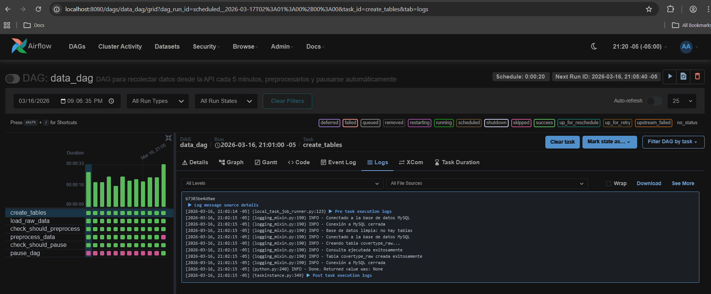

### 2. Carga de Datos por Batches

> Captura que muestra la tarea `load_raw_data` obteniendo datos de la API e insertandolos en MySQL.

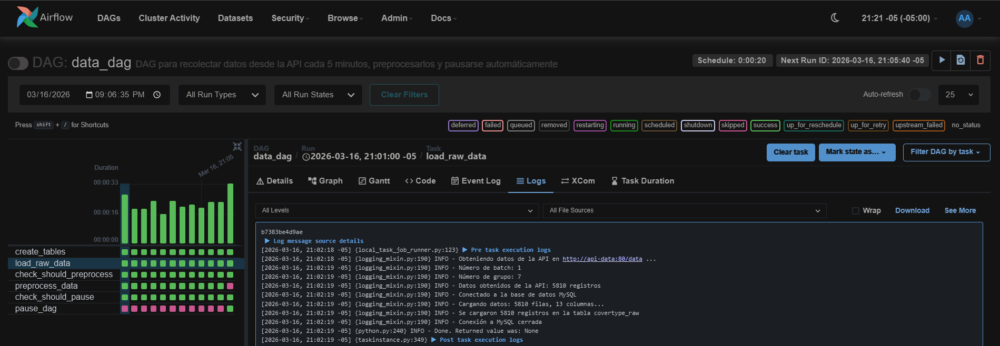

### 3. Preprocesamiento en Cada Iteracion con Datos Nuevos

> Captura que muestra como `check_should_preprocess` habilita `preprocess_data` cuando `load_raw_data` inserta una nueva porcion del batch.

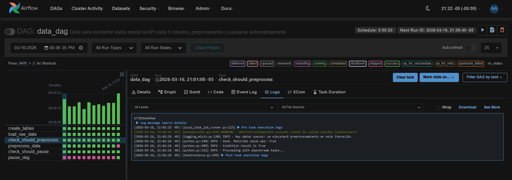

### 4. Actualizacion de Tabla Cleaned por Iteracion

> Captura que muestra `covertype_cleaned` recargada en una corrida intermedia (sin esperar al ultimo batch).

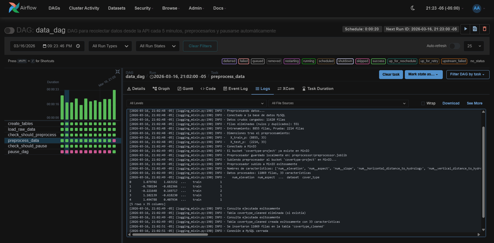

### 5. Carga del Preprocesador a MinIO

> Captura que muestra el preprocesador (`preprocessor.joblib`) almacenado en el bucket de MinIO.

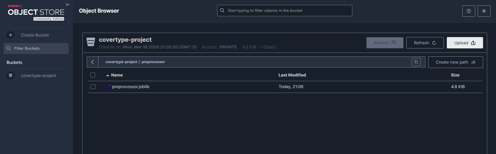

### 6. Datos en MySQL (Tabla Raw)

> Captura que muestra los datos crudos almacenados en la tabla `covertype_raw`.

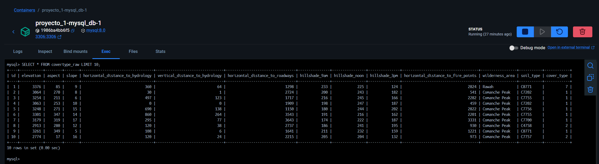

### 7. Datos en MySQL (Tabla Cleaned)

> Captura que muestra los datos preprocesados en la tabla `covertype_cleaned` con las columnas transformadas.

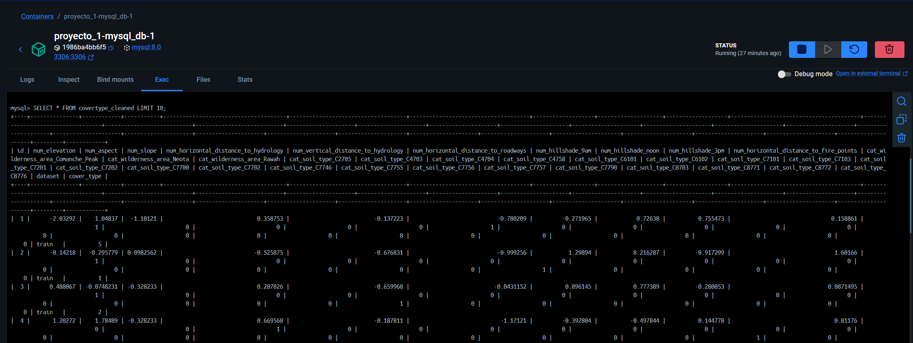

### 8. Fin de Recoleccion y Pausa del DAG

> Captura que muestra `check_should_pause` en `success` y `pause_dag` ejecutado cuando la API responde que ya se recolecto toda la informacion minima.

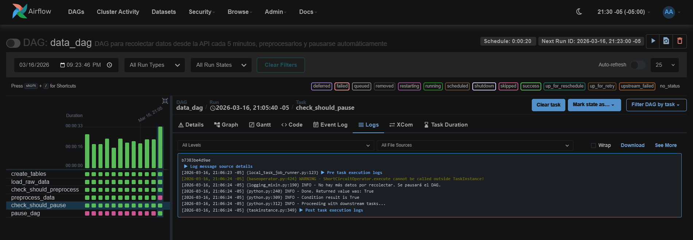

### 9. Vista General del DAG en Airflow

> Captura de la vista de grafo del DAG mostrando el flujo completo de tareas.

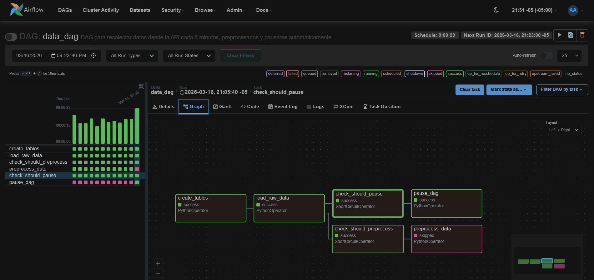

### 10. Historial de Ejecuciones

> Captura del historial mostrando varias corridas con preprocesamiento exitoso y la corrida final que pausa el DAG.

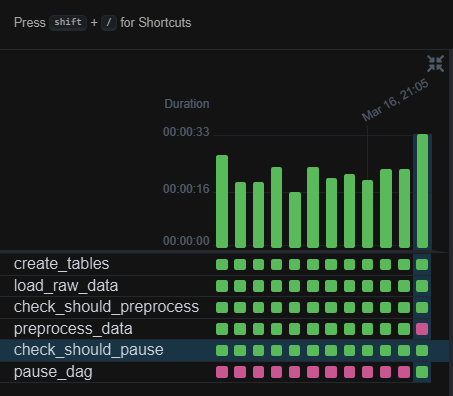

---

## Evidencias de la API de Inferencia

### 1. Documentacion de Endpoints (Swagger)

> Captura de `http://localhost:8001/docs` mostrando los endpoints disponibles (`GET /models` y `POST /predict`).

<!-- 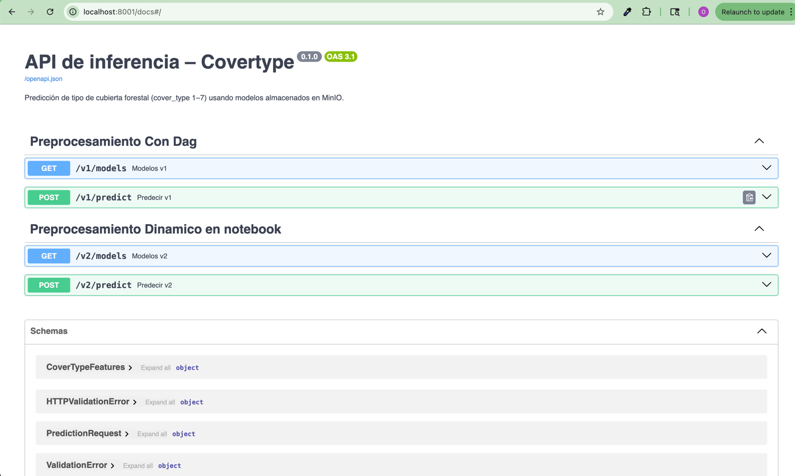 -->

### 2. Listado de Modelos Disponibles

> Captura de la respuesta de `GET /models`, evidenciando que la API consulta MinIO y lista modelos para seleccionar.

<!-- 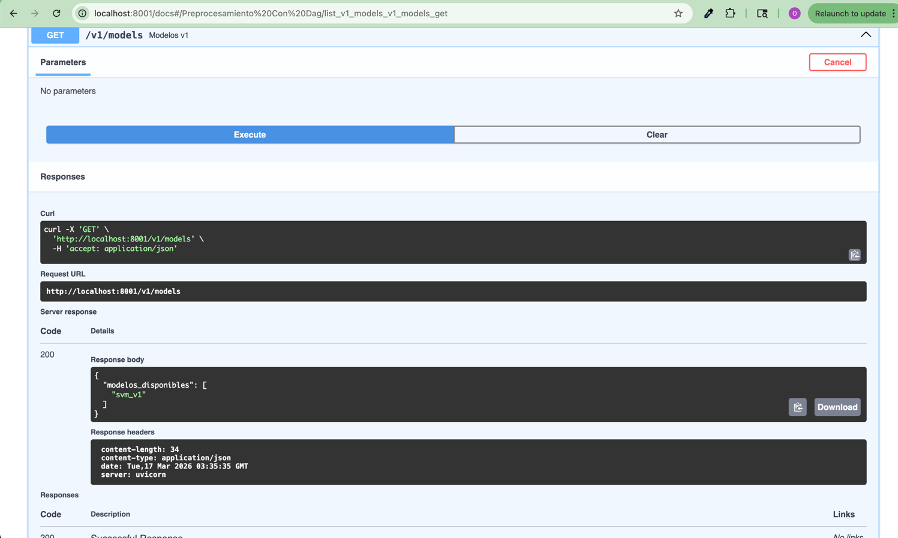 -->

### 3. Seleccion de Modelo en Prediccion

> Captura de `POST /predict` en Swagger donde se elige el campo `model` (por ejemplo `random_forest_v1`) y se envian las features de entrada.

<!-- 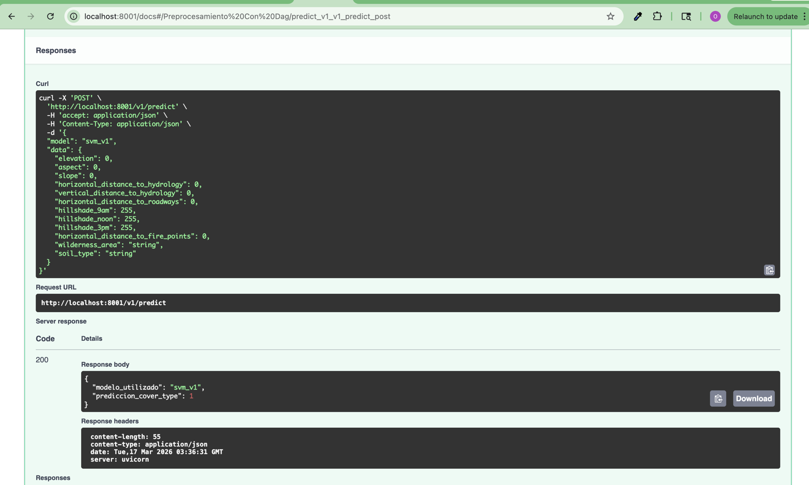 -->

### 4. Respuesta de Prediccion

> Captura de la respuesta exitosa de `POST /predict`, mostrando `modelo_utilizado` y `prediccion_cover_type`.

<!--  -->

---

## Evidencias del Notebook de Entrenamiento y MinIO

### 1. Lectura de Datos Limpios desde MySQL

> Captura de una celda en `model_training/train.ipynb` leyendo la tabla `covertype_cleaned` como fuente para entrenamiento.

<!--  -->

### 2. Entrenamiento de Modelos

> Captura de celdas donde se entrenan modelos (ej. Random Forest, XGBoost u otros definidos en el notebook) y se reportan metricas.

<!-- 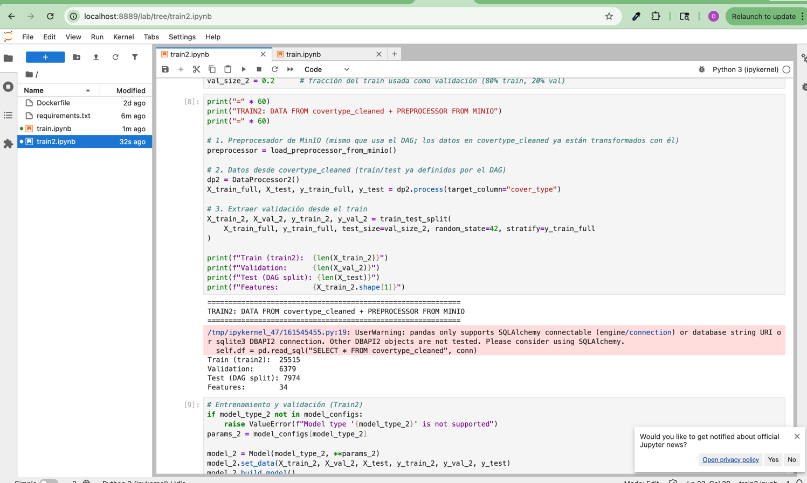 -->

### 3. Serializacion de Modelo y Preprocesador

> Captura de celdas donde se generan artefactos `.joblib` del modelo y del preprocesador con el mismo nombre base.

<!-- 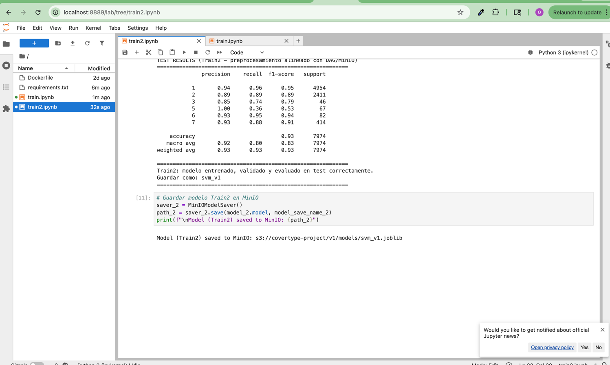 -->

### 4. Carga de Artefactos en MinIO

> Captura de celdas/subidas mostrando almacenamiento en `models/<nombre>.joblib` y `preprocessor/<nombre>.joblib` dentro del bucket `covertype-project`.

<!-- 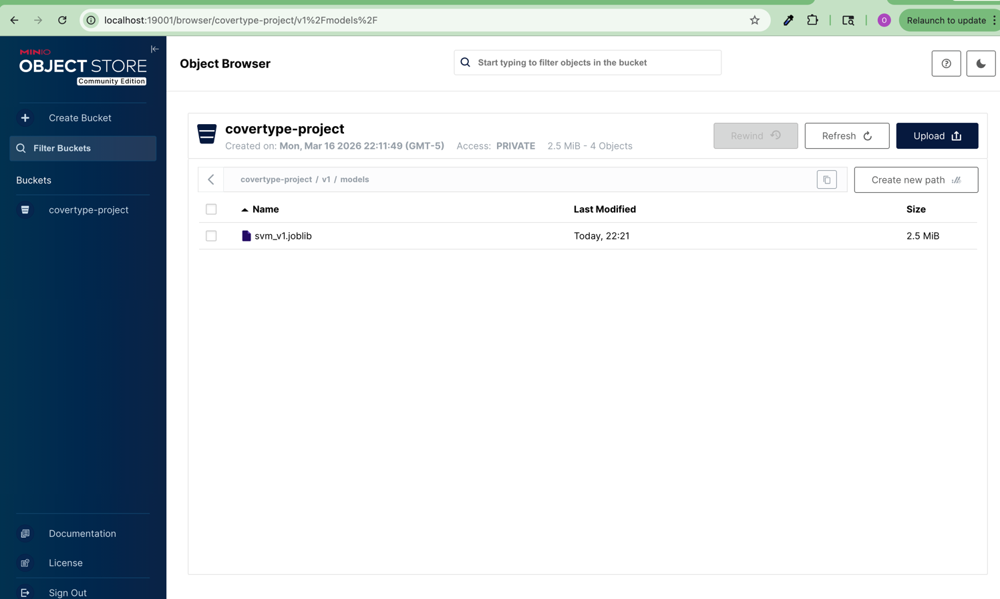 -->

### 5. Verificacion en MinIO Console

> Captura de `http://localhost:19001` mostrando ambos artefactos disponibles para consumo desde `inference_api`.

<!-- 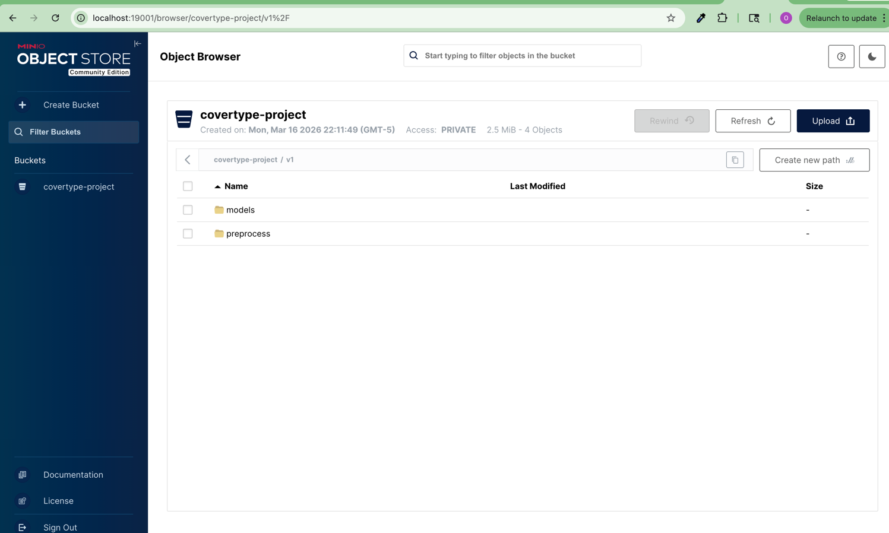 -->

---

## Como Ejecutar el Proyecto

### Prerrequisitos

- [Docker](https://docs.docker.com/get-docker/) y [Docker Compose](https://docs.docker.com/compose/install/) instalados
- Puerto `8080` (Airflow), `3306` (MySQL), `19000`/`19001` (MinIO) disponibles

### 1. Configurar Variables de Entorno

Copiar el archivo de ejemplo y completar con los valores correspondientes:

```bash
cp .env.example .env
```

Editar el archivo `.env` con las credenciales y configuraciones necesarias:

```env
# MySQL
AIRFLOW_UID=50000
AIRFLOW_PROJ_DIR=../Airflow

MYSQL_HOST=mysql_db
MYSQL_USER=airflow
MYSQL_PASSWORD=airflow
MYSQL_DATABASE=covertype_data

# MinIO
MINIO_ENDPOINT=http://minio:9000
AWS_ACCESS_KEY_ID=<tu_access_key>
AWS_SECRET_ACCESS_KEY=<tu_secret_key>
AWS_DEFAULT_REGION=us-east-1

# API de Datos
API_URL=http://api-data:80          # Para pruebas locales (red docker)
# API_URL=http://10.43.101.94:8080  # Para la API del profesor
API_GROUP_NUMBER=<tu_numero_de_grupo>
```

### 2. Construir y Levantar los Servicios

```bash
cd Proyecto_1
docker compose up --build -d
```

### 3. (Opcional) Levantar la API de Datos para Pruebas Locales

Si se desea probar con la API de datos local en lugar de la API del profesor:

```bash
cd data-api
docker compose up --build -d
```

### 4. Acceder a los Servicios

| Servicio          | URL                                              | Credenciales           |
| ----------------- | ------------------------------------------------ | ---------------------- |
| **Airflow**       | [http://localhost:8080](http://localhost:8080)   | `airflow` / `airflow`  |
| **MinIO Console** | [http://localhost:19001](http://localhost:19001) | Configuradas en `.env` |

### 5. Activar el DAG

1. Abrir la interfaz web de Airflow en `http://localhost:8080`
2. Buscar el DAG `data_dag`
3. Activar el toggle para habilitar el DAG (despausar)
4. El DAG comenzara a ejecutarse automaticamente segun el intervalo configurado

### 6. Monitorear la Ejecucion

- En la vista de **Grid** o **Graph** del DAG se puede observar el progreso de cada ejecucion
- En cada corrida con datos nuevos, `preprocess_data` debe quedar en **success**
- `check_should_pause` y `pause_dag` solo deben ejecutarse cuando la API indique fin de recoleccion
- Una vez ejecutado `pause_dag`, el DAG quedara pausado automaticamente

---

## Componentes de Entrenamiento e Inferencia

### `model_training`

Servicio para entrenar modelos desde JupyterLab en `http://localhost:8888`.

- Fuente de datos esperada: tabla limpia `covertype_cleaned` en MySQL
- Dependencias principales: `mysql_db` y `minio`
- Artefactos de salida: modelos en `models/` y preprocesadores en `preprocessor/` dentro del bucket `covertype-project`
- Punto clave del flujo: el entrenamiento importante es el que consume exclusivamente datos ya limpios desde `covertype_cleaned`

### `inference_api`

API FastAPI de inferencia en `http://localhost:8001`.

- Endpoint `GET /models`: lista modelos disponibles en MinIO
- Endpoint `POST /predict`: carga modelo y preprocesador por nombre, transforma entrada y retorna `cover_type` predicho
- Requisito operativo: para cada modelo `X`, debe existir `models/X.joblib` y `preprocessor/X.joblib`
- Dependencia principal: MinIO (`covertype-project`)

### Detener los Servicios

```bash
docker compose down
```

Para eliminar tambien los volumenes (datos persistentes):

```bash
docker compose down -v
```

---

## Dataset: Covertype

El dataset **Forest Covertype** contiene informacion cartografica utilizada para predecir el tipo de cobertura forestal. Incluye las siguientes caracteristicas:

| Caracteristica                       | Tipo       | Descripcion                                          |
| ------------------------------------ | ---------- | ---------------------------------------------------- |
| `elevation`                          | Numerica   | Elevacion en metros                                  |
| `aspect`                             | Numerica   | Aspecto en grados azimut                             |
| `slope`                              | Numerica   | Pendiente en grados                                  |
| `horizontal_distance_to_hydrology`   | Numerica   | Distancia horizontal a la fuente de agua mas cercana |
| `vertical_distance_to_hydrology`     | Numerica   | Distancia vertical a la fuente de agua mas cercana   |
| `horizontal_distance_to_roadways`    | Numerica   | Distancia horizontal al camino mas cercano           |
| `hillshade_9am`                      | Numerica   | Indice de sombra a las 9am (0-255)                   |
| `hillshade_noon`                     | Numerica   | Indice de sombra al mediodia (0-255)                 |
| `hillshade_3pm`                      | Numerica   | Indice de sombra a las 3pm (0-255)                   |
| `horizontal_distance_to_fire_points` | Numerica   | Distancia horizontal al punto de fuego mas cercano   |
| `wilderness_area`                    | Categorica | Area silvestre designada                             |
| `soil_type`                          | Categorica | Tipo de suelo                                        |
| `cover_type`                         | Objetivo   | Tipo de cobertura forestal (1-7)                     |

---

## Tecnologias Utilizadas

- **Apache Airflow** - Orquestacion de pipelines
- **MySQL** - Almacenamiento de datos estructurados
- **MinIO** - Almacenamiento de objetos (artefactos ML)
- **Docker y Docker Compose** - Contenedorizacion y orquestacion de servicios
- **scikit-learn** - Preprocesamiento de datos (StandardScaler, OneHotEncoder, SimpleImputer)
- **FastAPI** - API de datos (pruebas locales)
- **Python** - Lenguaje principal
