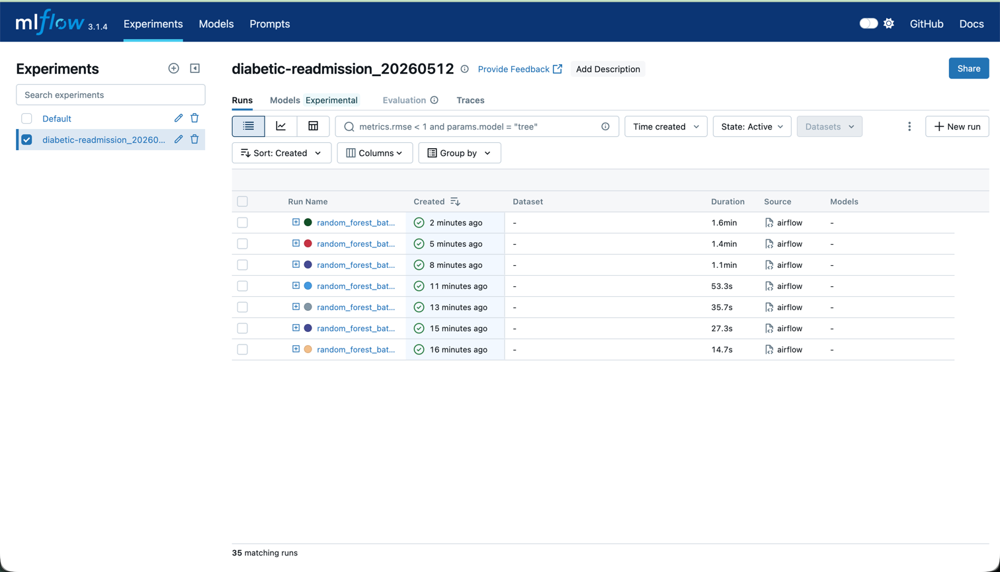
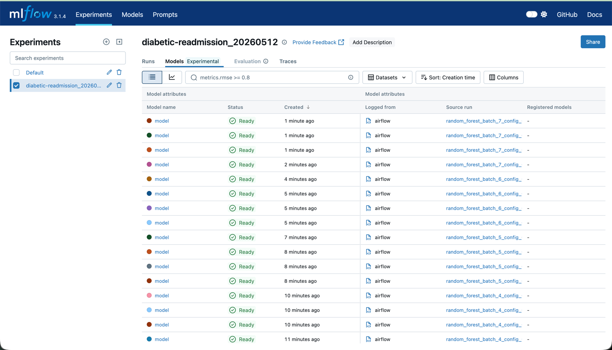
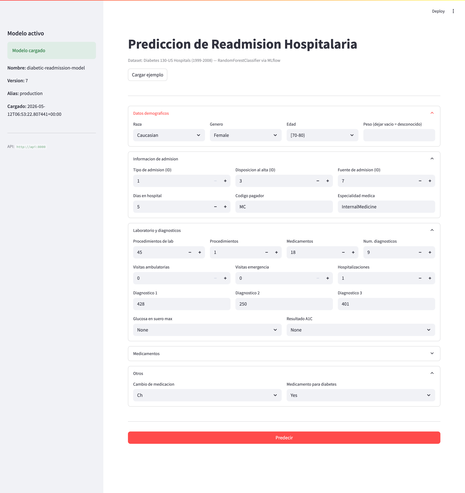
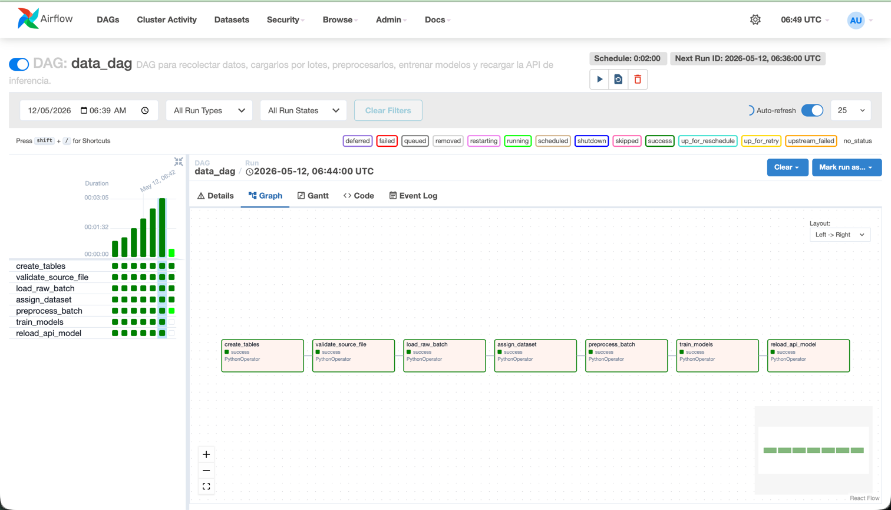
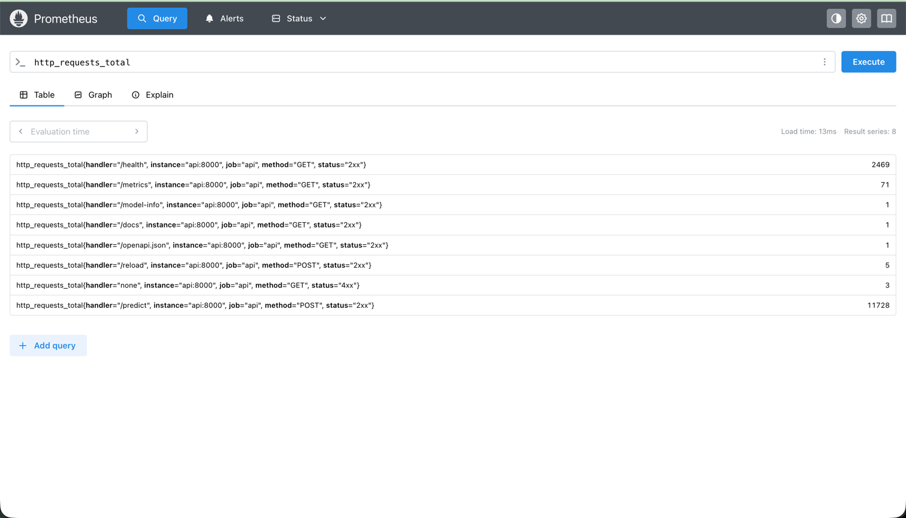
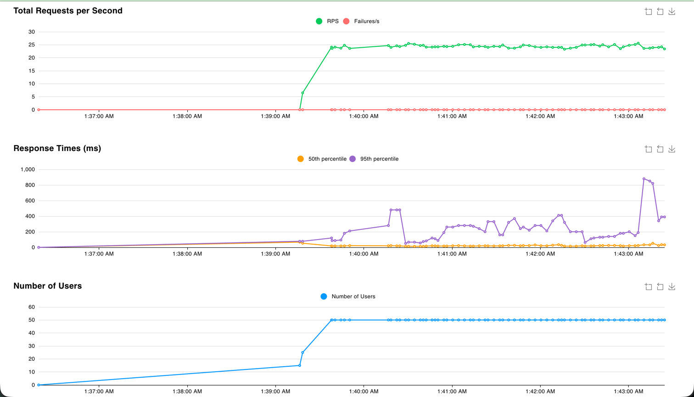
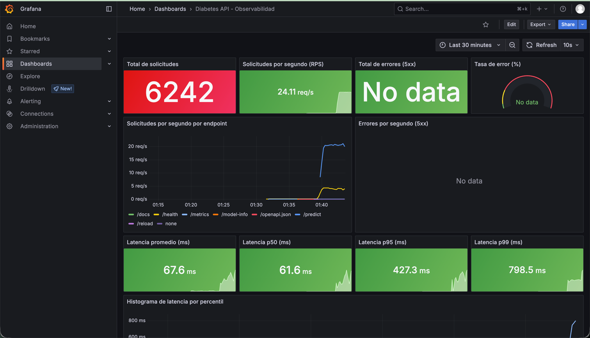
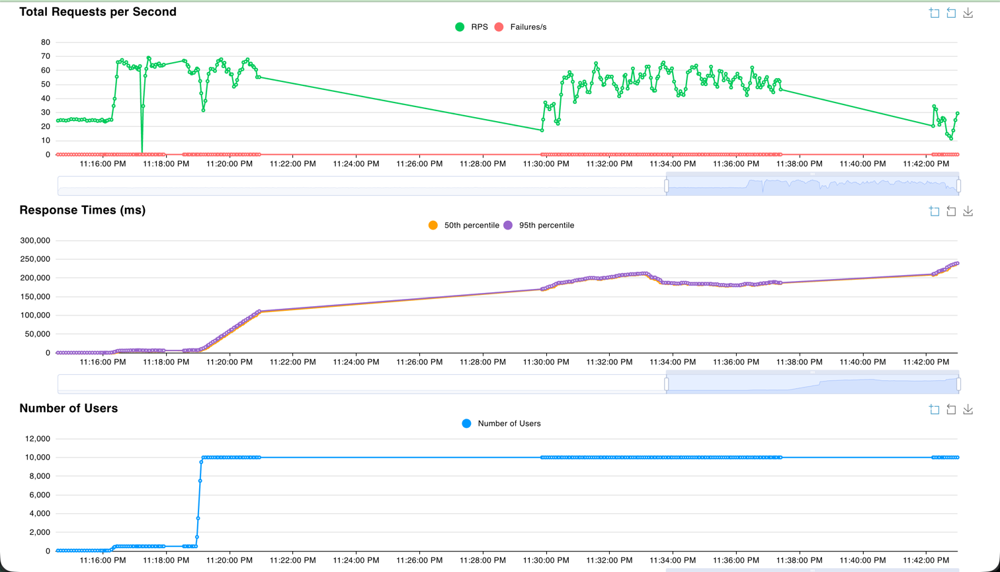
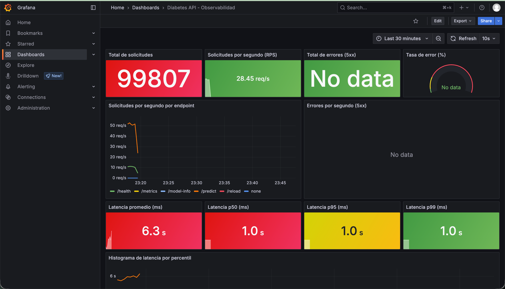

# Proyecto 2 - MLOps: Readmision Hospitalaria Diabetica

Sistema completo de MLOps desplegado en Kubernetes que cubre el ciclo de vida de un modelo de Machine Learning: ingesta incremental de datos, preprocesamiento, entrenamiento, registro de modelos, inferencia via API, interfaz grafica, pruebas de carga y observabilidad.

El caso de uso es la prediccion de readmision hospitalaria en menos de 30 dias para pacientes diabeticos, usando el dataset *Diabetes 130-US Hospitals (1999-2008)*.

---

## Indice

1. [Tecnologias](#tecnologias)
2. [Arquitectura](#arquitectura)
3. [Estructura del repositorio](#estructura-del-repositorio)
4. [Modo desarrollo (Docker Compose)](#modo-desarrollo-docker-compose)
5. [Despliegue en Kubernetes](#despliegue-en-kubernetes)
6. [Configuracion en Kubernetes](#configuracion-en-kubernetes)
7. [Makefile](#makefile)
8. [Servicios](#servicios)
9. [DAG de Airflow](#dag-de-airflow)
10. [Base de datos](#base-de-datos)
11. [Observabilidad](#observabilidad)
12. [Pruebas de carga](#pruebas-de-carga)
13. [Troubleshooting](#troubleshooting)
14. [Challenges y proceso de validacion](#challenges-y-proceso-de-validacion)

---

## Tecnologias

| Categoria | Herramienta |
|---|---|
| Orquestacion | Apache Airflow 2.11 |
| Tracking de experimentos | MLflow 3.1 |
| Almacenamiento de artefactos | MinIO (S3 compatible) |
| Base de datos | PostgreSQL 13 |
| API de inferencia | FastAPI |
| Interfaz grafica | Streamlit |
| Pruebas de carga | Locust |
| Metricas | Prometheus + Grafana |
| Contenedores | Docker |
| Orquestacion de contenedores | Kubernetes (Docker Desktop) |
| Gestion de charts | Helm |
| Modelo | RandomForestClassifier (scikit-learn) |

---

## Arquitectura

El sistema esta dividido en dos fases:

**Fase de entrenamiento** — Airflow orquesta la carga incremental del dataset por lotes de hasta 15.000 registros, almacena los datos crudos en PostgreSQL, los preprocesa, entrena modelos y registra experimentos en MLflow. El mejor modelo segun `recall_<30` (recall de la clase de readmision en menos de 30 dias) queda disponible en MLflow con el alias `production`.

**Fase de inferencia** — La API de FastAPI carga el modelo productivo desde MLflow dinamicamente. Cada prediccion queda registrada en la base de datos. Streamlit permite interactuar con la API desde una interfaz grafica. Prometheus recolecta metricas de la API y Grafana las visualiza en tiempo real.

<!-- IMAGEN: diagrama de arquitectura -->

---

## Estructura del repositorio

```
Proyecto_2/
├── Airflow/
│   ├── dags/
│   │   ├── data_dag.py          # DAG principal
│   │   └── utils/               # Modulos: db, ingestion, preprocess, training...
│   ├── Dockerfile               # Imagen para Kubernetes (Helm)
│   ├── Dockerfile.Compose       # Imagen para Docker Compose
│   ├── requirements.txt
│   └── values/
│       └── values-local.yaml    # Values de Helm para despliegue local
├── api/
│   ├── main.py                  # Entry point: crea la app y registra el router
│   ├── app/
│   │   ├── config.py            # Variables de entorno
│   │   ├── database.py          # Conexion PostgreSQL e inference logging
│   │   ├── model.py             # Carga del modelo desde MLflow
│   │   ├── router.py            # Endpoints de la API
│   │   └── schemas.py           # PredictRequest y to_dataframe()
│   ├── Dockerfile
│   └── requirements.txt
├── streamlit/
│   ├── app.py                   # Interfaz grafica
│   ├── Dockerfile
│   └── requirements.txt
├── locust/
│   ├── locustfile.py            # Escenario de prueba de carga
│   ├── Dockerfile
│   └── requirements.txt
├── mlflow/
│   └── Dockerfile               # MLflow con backend PostgreSQL y MinIO
├── prometheus/
│   └── prometheus.yml           # Configuracion de scraping
├── grafana/
│   ├── provisioning/            # Datasource y dashboard provider
│   └── dashboards/
│       └── api_dashboard.json   # Dashboard exportado
├── komposefiles/                # Manifiestos de Kubernetes por servicio
│   ├── api/
│   ├── minio/
│   ├── mlflow/
│   ├── postgres_dataset/
│   ├── streamlit/
│   ├── locust/
│   ├── prometheus/
│   └── grafana/
├── compose/                     # Docker Compose por servicio
├── docker-compose.yaml          # Compose unificado
├── Makefile                     # Automatizacion de tareas
└── .env.example                 # Variables de entorno para Compose
```

---

## Modo desarrollo (Docker Compose)

Para desarrollar, probar cambios o explorar el sistema sin necesidad de un cluster de Kubernetes, el proyecto incluye un stack completo con Docker Compose. Es la forma mas rapida de levantar todo el entorno en una sola maquina.

### Prerequisitos

- Docker Desktop instalado y corriendo
- No se necesita Kubernetes habilitado

### 1. Crear el archivo de variables de entorno

El Compose necesita dos variables que se leen desde un archivo `.env` en la raiz del proyecto. Copiarlo desde el ejemplo incluido:

```bash
cp .env.example .env
```

El archivo `.env` contiene:

```bash
# UID del usuario en el sistema (en Linux usar: id -u)
# En macOS/Windows dejar en 50000
AIRFLOW_UID=50000

# Ruta a la carpeta de Airflow, relativa al directorio compose/
# No modificar salvo que se cambie la estructura del repo
AIRFLOW_PROJ_DIR=../Airflow
```

> En Linux es importante ajustar `AIRFLOW_UID` al UID real del usuario (`id -u`) para que los volumenes montados de Airflow tengan los permisos correctos.

### 2. Levantar el stack completo

```bash
make compose-up
```

O directamente con Docker Compose:

```bash
docker compose up -d --build
```

Este comando levanta todos los servicios definidos en `docker-compose.yaml`:

| Servicio | Puerto | URL |
|---|---|---|
| Airflow | 8080 | http://localhost:8080 |
| MLflow | 5000 | http://localhost:5000 |
| MinIO (API) | 9000 | — |
| MinIO (Consola) | 9001 | http://localhost:9001 |
| PostgreSQL dataset | 5432 | — |
| Adminer | 8081 | http://localhost:8081 |
| API FastAPI | 8000 | http://localhost:8000/docs |
| Streamlit | 8501 | http://localhost:8501 |
| Locust | 8089 | http://localhost:8089 |
| Prometheus | 9090 | http://localhost:9090 |
| Grafana | 3000 | http://localhost:3000 |

### 3. Verificar que los servicios esten listos

```bash
make compose-logs
```

Airflow tarda aproximadamente un minuto en inicializar. Los demas servicios suelen estar listos en menos de 30 segundos.

### 4. Detener el stack

```bash
make compose-down
```

### Diferencias con el despliegue en Kubernetes

| Aspecto | Docker Compose | Kubernetes |
|---|---|---|
| Imagenes | Se construyen localmente con `--build` | Deben estar publicadas en DockerHub |
| Airflow | Imagen `Dockerfile.Compose` (montaje de DAGs en vivo) | Imagen `Dockerfile` (DAGs copiados en la imagen) |
| Configuracion | Variables directas en los archivos `compose/*.yml` | ConfigMaps y Secrets separados |
| Uso recomendado | Desarrollo y pruebas locales | Demostracion y entorno de produccion |

---

## Despliegue en Kubernetes

El despliegue completo corre sobre un cluster local de Kubernetes (Docker Desktop). Airflow se instala via Helm y el resto de servicios con manifiestos YAML aplicados con `kubectl`.

### Prerequisitos

- Docker Desktop con Kubernetes habilitado (**Settings → Kubernetes → Enable Kubernetes**)

### 1. Desplegar todo

```bash
make deploy
```

Este comando ejecuta en orden:
- Crea el namespace `proyecto-2-mlops`
- Despliega PostgreSQL, MinIO y MLflow
- Espera que la infra este lista
- Inicializa los buckets de MinIO
- Despliega la API, Streamlit y Locust
- Despliega Prometheus y Grafana
- Instala Airflow via Helm

### 2. Acceder a los servicios

```bash
make forward
```

| Servicio | URL | Credenciales |
|---|---|---|
| Airflow | http://localhost:8080 | airflow / airflow |
| MLflow | http://localhost:5000 | — |
| API (docs) | http://localhost:8000/docs | — |
| Streamlit | http://localhost:8501 | — |
| Locust | http://localhost:8089 | — |
| Prometheus | http://localhost:9090 | — |
| Grafana | http://localhost:3000 | admin / admin |

### 3. Eliminar el despliegue

```bash
make delete
```

> **Solo si se modifican las imagenes del proyecto** (API, MLflow, Streamlit, Locust o Airflow): reconstruir, publicar en DockerHub y actualizar las referencias antes de desplegar.
>
> ```bash
> make build-push DOCKER_USER=tu_usuario
> make set-user   DOCKER_USER=tu_usuario
> make deploy
> ```

---

## Configuracion en Kubernetes

Toda la configuracion del sistema esta externalizada en objetos de Kubernetes en lugar de estar quemada en las imagenes o los manifiestos de despliegue. Se usa la distincion nativa de Kubernetes entre **ConfigMap** y **Secret**:

- **ConfigMap** — variables no sensibles: URLs de servicios internos, nombres de bases de datos, puertos, nombres de modelos.
- **Secret** — variables sensibles: contrasenas, usuarios de bases de datos, claves de acceso a MinIO/S3. Los Secrets se almacenan codificados en base64 y Kubernetes los inyecta en los pods como variables de entorno sin exponerlos en los logs ni en los manifiestos de despliegue.

Ningun Dockerfile del proyecto contiene credenciales. El caso mas relevante es el servidor de MLflow, cuyo comando de inicio construye la URI de conexion a PostgreSQL en tiempo de ejecucion a partir de variables inyectadas por el Secret, en lugar de tener `usuario:contrasena@host` quemado en la imagen.

### Distribucion por servicio

| Servicio | ConfigMap | Secret |
|---|---|---|
| `postgres-dataset` | `POSTGRES_DB` | `POSTGRES_USER`, `POSTGRES_PASSWORD` |
| `minio` | — | `MINIO_ROOT_USER`, `MINIO_ROOT_PASSWORD` |
| `minio-init` | — | referencia a `minio-secret` via `secretKeyRef` |
| `mlflow-db` | `POSTGRES_DB` | `POSTGRES_USER`, `POSTGRES_PASSWORD` |
| `mlflow` | `MLFLOW_S3_ENDPOINT_URL`, `MLFLOW_DB_HOST`, `MLFLOW_DB_PORT`, `MLFLOW_DB_NAME` | `AWS_ACCESS_KEY_ID`, `AWS_SECRET_ACCESS_KEY`, `MLFLOW_DB_USER`, `MLFLOW_DB_PASSWORD` |
| `api` | `MLFLOW_TRACKING_URI`, `MLFLOW_S3_ENDPOINT_URL`, `POSTGRES_DATASET_HOST/PORT/DATABASE`, `REGISTERED_MODEL_NAME`, `MODEL_ALIAS` | `AWS_ACCESS_KEY_ID`, `AWS_SECRET_ACCESS_KEY`, `POSTGRES_DATASET_USER`, `POSTGRES_DATASET_PASSWORD` |
| `grafana` | configuracion de datasource y dashboard (via ConfigMap) | `GF_SECURITY_ADMIN_USER`, `GF_SECURITY_ADMIN_PASSWORD` |
| `streamlit` | `API_URL` | — |
| `locust` | `LOCUST_HOST` | — |

### Como modificar credenciales

Para cambiar cualquier credencial basta editar el Secret correspondiente en `komposefiles/<servicio>/` y reaplicarlo:

```bash
kubectl apply -f komposefiles/postgres_dataset/postgres-dataset-secret.yaml -n proyecto-2-mlops
kubectl rollout restart deployment/postgres-dataset -n proyecto-2-mlops
```

---

## Makefile

Se implemento un `Makefile` para centralizar todas las operaciones del proyecto y evitar tener que recordar y repetir comandos largos de Docker, kubectl y Helm. Cada target encapsula una operacion especifica y pueden encadenarse.

### Comandos disponibles

#### Docker Compose

| Comando | Descripcion |
|---|---|
| `make compose-up` | Levanta todo el stack con Docker Compose |
| `make compose-down` | Detiene y elimina los contenedores |
| `make compose-logs` | Muestra logs en tiempo real |

#### Imagenes

| Comando | Descripcion |
|---|---|
| `make build` | Construye las 5 imagenes del proyecto |
| `make push` | Publica las imagenes en DockerHub |
| `make build-push` | Construye y publica en un solo paso |

#### Kubernetes

| Comando | Descripcion |
|---|---|
| `make set-user` | Actualiza el usuario de DockerHub en todos los manifiestos |
| `make deploy` | Despliega todo el stack en Kubernetes (orden correcto) |
| `make deploy-infra` | Solo despliega PostgreSQL, MinIO y MLflow |
| `make deploy-api` | Solo despliega la API |
| `make deploy-ui` | Solo despliega Streamlit y Locust |
| `make deploy-obs` | Solo despliega Prometheus y Grafana |
| `make deploy-airflow` | Solo instala Airflow via Helm (instala Helm si no existe) |
| `make status` | Lista todos los pods y su estado |
| `make logs SVC=api` | Muestra logs de un servicio especifico |
| `make describe SVC=api` | Describe el pod de un servicio |
| `make forward` | Abre port-forwards para todos los servicios |
| `make stop-forward` | Cierra todos los port-forwards |
| `make delete` | Elimina el namespace y todos los recursos |

---

## Servicios

### Airflow

Orquesta el pipeline completo de datos y entrenamiento. Corre con `LocalExecutor` dentro del cluster usando el chart oficial de Apache Airflow instalado via Helm.

- Imagen personalizada con los DAGs y dependencias del proyecto
- Variables de entorno para conectarse a PostgreSQL, MinIO y MLflow
- Configuracion en `Airflow/values/values-local.yaml`

<!-- IMAGEN: vista del DAG en Airflow con las 7 tareas en verde -->

---

### PostgreSQL — dataset

Almacena todas las capas de datos del proyecto en tablas separadas dentro de la base `diabetic_data`.

| Tabla | Descripcion |
|---|---|
| `diabetic_data_raw` | Datos crudos tal como llegan del CSV, con metadatos de batch |
| `diabetic_data_split` | Asignacion train/test por registro |
| `diabetic_data_cleaned` | Datos procesados listos para entrenamiento |
| `diabetic_data_processed_batches` | Auditoria de versiones del preprocesador |
| `inference_logs` | Registro de cada prediccion realizada por la API |

<!-- IMAGEN: tablas en Adminer o psql -->

---

### MinIO

Almacenamiento de objetos compatible con S3. Contiene dos buckets:

- `mlflows3` — artefactos de MLflow (modelos, metricas, reportes)
- `diabetic-project` — preprocesadores versionados por batch

<!-- IMAGEN: consola de MinIO con los buckets -->

---

### MLflow

Servidor de tracking de experimentos y registro de modelos.

- Backend store: PostgreSQL (`mlflow-db`)
- Artifact store: MinIO (`mlflows3`)
- Experimentos nombrados `diabetic-readmission_YYYYMMDD`
- Modelo registrado: `diabetic-readmission-model` con alias `production`
- Metrica principal de seleccion: `recall_<30` (recall de readmision en menos de 30 dias)



La vista de runs muestra el experimento `diabetic-readmission_20260512` con **35 ejecuciones registradas**, todas exitosas (icono verde). Cada run corresponde a una ejecucion de la tarea `train_models` del DAG. Las duraciones crecen progresivamente — de 14.7 s en el primer batch a 1.6 min en el batch mas reciente — porque el dataset de entrenamiento se acumula con cada lote incremental: a mayor cantidad de datos, mayor tiempo de ajuste del RandomForest. Todos los runs fueron disparados desde `airflow` como fuente.



La pestana Models muestra los artefactos de modelo generados. Cada batch entrena **multiples configuraciones de RandomForest** (variaciones de hiperparametros), todas con status `Ready`. Los source runs corresponden a `random_forest_batch_4_config_`, `batch_5`, `batch_6` y `batch_7`, lo que confirma que el DAG registro modelos en al menos 4 batches distintos. El DAG evalua todas las configuraciones de cada batch y promueve la de mejor `recall_<30` al alias `production` en el Model Registry, que es la que carga la API al arrancar.

---

### API de inferencia (FastAPI)

Expone el modelo productivo como servicio HTTP. Carga el modelo desde MLflow al iniciar usando el alias `production` — si el modelo productivo cambia en MLflow, basta llamar a `/reload` para actualizarlo sin reiniciar el contenedor.

Cada prediccion queda registrada automaticamente en la tabla `inference_logs`.

**Endpoints:**

| Endpoint | Metodo | Descripcion |
|---|---|---|
| `/health` | GET | Estado de la API y del modelo cargado |
| `/predict` | POST | Recibe features del paciente y retorna prediccion |
| `/reload` | POST | Recarga el modelo productivo desde MLflow |
| `/model-info` | GET | Nombre, version y alias del modelo activo |
| `/metrics` | GET | Metricas en formato Prometheus |

**Respuesta de `/predict`:**
```json
{
  "prediction": "<30",
  "probabilities": {"<30": 0.61, ">30": 0.28, "NO": 0.11},
  "model_name": "diabetic-readmission-model",
  "model_version": "3",
  "model_alias": "production",
  "response_time_ms": 42.3
}
```

<!-- IMAGEN: /docs de FastAPI -->
<!-- IMAGEN: ejemplo de respuesta de /predict -->

---

### Streamlit

Interfaz grafica para interactuar con la API sin necesidad de usar curl o Postman.

- Sidebar con informacion del modelo activo en tiempo real
- Boton para cargar valores de ejemplo del dataset
- Formulario con los 47 campos del dataset organizados en secciones
- Resultado con color segun la clase predicha
- Probabilidades por clase y tiempo de respuesta
- Manejo de errores (modelo no listo, timeout, validacion)

**Formulario listo para predecir**

El sidebar confirma el modelo activo (`diabetic-readmission-model` v7, alias `production`) junto con la fecha de carga. El formulario muestra los 47 campos organizados en secciones colapsables: datos demograficos, admision, laboratorio/diagnosticos, medicamentos y otros. El boton "Cargar ejemplo" rellena todos los campos con un registro real del dataset para facilitar la demostracion.



**Resultado de la prediccion**

Tras presionar "Predecir", el resultado aparece debajo del formulario con un bloque coloreado segun la clase: rojo para `<30` (readmision en menos de 30 dias), naranja para `>30` y verde para `NO`. En este ejemplo el modelo predice **readmision en menos de 30 dias** con un 39.7 % de probabilidad, seguido de `>30` (34.2 %) y `NO` (26.0 %). Las barras de progreso y el grafico de barras permiten comparar las probabilidades de un vistazo. La seccion de informacion de la inferencia muestra el modelo, version, alias y el tiempo de respuesta de la API (195.2 ms en este caso).


---

### Locust

Herramienta de pruebas de carga para evaluar el comportamiento de la API bajo concurrencia.

- Escenario principal: POST a `/predict` con payload real del dataset (peso 5)
- Escenario secundario: GET a `/health` (peso 1)
- Accesible via UI web en el puerto 8089

Durante la sustentacion se ejecuta con ~50 usuarios y spawn rate de 5, mientras se observa el efecto en Grafana.

<!-- IMAGEN: UI de Locust con estadisticas de carga -->

---

### Prometheus

Recolecta metricas de la API cada 15 segundos desde el endpoint `/metrics`. La configuracion de scraping esta en `prometheus/prometheus.yml` y se monta en el pod via ConfigMap.

Jobs configurados:
- `api` — raspa `api:8000/metrics`
- `prometheus` — auto-scrape de Prometheus

<!-- IMAGEN: Prometheus Targets con api en UP -->

---

### Grafana

Visualiza las metricas recolectadas por Prometheus. El dashboard se provisiona automaticamente al arrancar el contenedor — no requiere configuracion manual.

**Dashboard: Diabetes API - Observabilidad**

| Panel | Tipo | Metrica |
|---|---|---|
| Total solicitudes | Stat | `sum(http_requests_total)` |
| RPS actual | Stat | `rate(http_requests_total[1m])` |
| Total errores 5xx | Stat | errores por codigo |
| Tasa de error | Gauge | ratio errores/total |
| RPS por endpoint | Time series | desglosado por handler |
| Errores/s | Time series | solo 5xx |
| Latencia promedio | Stat | media en ms |
| Latencia p50 | Stat | percentil 50 |
| Latencia p95 | Stat | percentil 95 |
| Latencia p99 | Stat | percentil 99 |
| Histograma latencia | Time series | p50 + p95 + p99 + promedio |

<!-- IMAGEN: dashboard de Grafana en reposo -->
<!-- IMAGEN: dashboard de Grafana durante prueba de carga con Locust -->

---

## DAG de Airflow

El DAG `data_dag` ejecuta el pipeline completo de forma incremental. Cada ejecucion procesa un lote de hasta 15.000 registros nuevos.

```
create_tables
    └── validate_source_file
            └── load_raw_batch
                    └── assign_dataset
                            └── preprocess_batch
                                    └── train_models
                                            └── reload_api_model
```

| Tarea | Descripcion |
|---|---|
| `create_tables` | Crea `diabetic_data_raw`, `diabetic_data_split` e `inference_logs` si no existen |
| `validate_source_file` | Verifica o descarga el dataset CSV |
| `load_raw_batch` | Lee el siguiente lote del CSV e inserta en `diabetic_data_raw` con metadatos de batch |
| `assign_dataset` | Asigna train/test de forma determinista a los registros nuevos |
| `preprocess_batch` | Imputa, escala y codifica; versiona el preprocesador en MinIO |
| `train_models` | Entrena RandomForest, registra en MLflow y promueve el mejor a `production` |
| `reload_api_model` | Llama a `POST /reload` en la API para cargar el nuevo modelo |

El DAG es reentrante: usa `CREATE TABLE IF NOT EXISTS` y variables de Airflow para el offset, por lo que puede ejecutarse multiples veces sin duplicar datos.



La imagen muestra el DAG `data_dag` con todas las ejecuciones en verde. El grafo de la derecha confirma la secuencia lineal de las 7 tareas. Las barras de duracion indican que cada ejecucion completa toma entre **1:32 y 3:05 minutos**, dependiendo del volumen del lote y el tiempo de entrenamiento. El schedule esta configurado cada 2 minutos, lo que permite procesar el dataset completo de 101,766 registros en aproximadamente 14 ejecuciones incrementales.

---

## Base de datos

### Tabla `diabetic_data_raw`

Almacena los datos tal como llegan del CSV, sin transformaciones destructivas.

| Campo | Descripcion |
|---|---|
| `id` | Identificador interno |
| `batch_id` | Numero de lote de carga |
| `load_timestamp` | Fecha y hora de insercion |
| `data_source` | Ruta del archivo fuente |
| `record_status` | Estado del registro |
| `source_record_id` | Hash del registro original |
| `row_hash` | Hash MD5 de la fila para detectar duplicados |
| *(columnas del dataset)* | Los 50 campos originales del dataset |

### Tabla `inference_logs`

Registra cada prediccion realizada por la API.

| Campo | Descripcion |
|---|---|
| `request_id` | UUID unico de la solicitud |
| `requested_at` | Timestamp de la inferencia |
| `input_data` | JSON con los datos de entrada |
| `prediction` | Clase predicha (`<30`, `>30`, `NO`) |
| `probabilities` | JSON con probabilidades por clase |
| `model_name` | Nombre del modelo usado |
| `model_version` | Version del modelo |
| `model_alias` | Alias productivo (`production`) |
| `response_time_ms` | Tiempo de respuesta en milisegundos |

---

## Observabilidad

La API expone metricas en `/metrics` compatibles con Prometheus gracias a `prometheus-fastapi-instrumentator`. Prometheus las recolecta cada 15 segundos y Grafana las visualiza en el dashboard pre-configurado con los siguientes paneles: RPS, tasa de error, latencia promedio, p50, p95 y p99.



Prometheus ejecutando la query `http_requests_total` muestra las 8 series de metricas recolectadas de la API. Los datos confirman que el scraping funciona correctamente: `/predict` acumulo **11,728 requests** (el endpoint de mayor carga), `/health` registro **2,469** (incluye las solicitudes de Locust con peso 1 y los health checks de Kubernetes), y `/metrics` aparece con **71** entradas que corresponden a los propios scrapes de Prometheus cada 15 segundos. Se registraron **3 requests con status 4xx** en el handler `none`, que corresponden a rutas no existentes probadas durante el desarrollo.

---

## Pruebas de carga

Las pruebas de carga se realizan con Locust desde su interfaz web en http://localhost:8089. El escenario implementado envia solicitudes reales de prediccion al endpoint `POST /predict` con datos del dataset de diabetes, simulando el uso real de la API.

Se ejecutaron tres tipos de prueba:

### Prueba de carga normal

Simula el uso tipico del sistema con pocos usuarios concurrentes.

- **Usuarios**: 50
- **Spawn rate**: 5 usuarios/segundo
- **Objetivo**: verificar que la API responde dentro de tiempos aceptables (p95 < 500 ms) en condiciones normales





**Resultados observados:**

- El RPS se estabilizo en **~24-25 req/s** de forma consistente durante toda la prueba, sin variaciones bruscas, lo que indica que la API manejo la carga sin saturarse.
- **Cero errores** en toda la ejecucion: ni Locust ni Grafana registraron respuestas 5xx.
- La **latencia mediana (p50) fue de 61.6 ms**, lo que significa que la mitad de las solicitudes se resolvieron en menos de 62 ms — un tiempo excelente para una prediccion con un modelo de Random Forest.
- El **p95 fue de 427.3 ms** y el **p99 de 798.5 ms**: los casos mas lentos (el 5% superior) tuvieron picos de hasta 850 ms visibles en Locust, pero se trata de valores puntuales, no de una degradacion sostenida.
- Grafana confirma que el trafico se distribuyó principalmente entre `/predict` (~20 req/s) y `/health` (~5 req/s), que es exactamente el escenario configurado en Locust (peso 5 vs peso 1).
- La conclusion es que con **50 usuarios concurrentes la API opera dentro de parametros normales**, cumpliendo el objetivo de p95 < 500 ms en la mayoria de los intervalos medidos.

### Prueba de estres — 10,000 usuarios

Prueba de saturacion para encontrar el limite de la API con una cantidad extrema de usuarios concurrentes.

- **Usuarios**: 10,000
- **Spawn rate**: 1,000 usuarios/segundo



**Resultados observados:**

- La API alcanzo un techo de aproximadamente **60-70 RPS** y no pudo escalar mas alla de ese punto con un solo pod.
- La latencia crecio de forma continua desde 0 hasta mas de **200,000 ms (200 segundos)**, lo que indica que las solicitudes se acumulaban en una cola interna sin poder ser procesadas a tiempo.
- El percentil 50 y el percentil 95 fueron practicamente identicos durante toda la prueba, lo que significa que **todos los usuarios sufrieron la misma degradacion**, no solo los casos extremos.
- **No se registraron errores HTTP**: las solicitudes completaban correctamente, pero con tiempos de espera inviables en produccion.
- La conclusion es que un unico pod de la API no esta disenado para soportar 10,000 usuarios simultaneos. La solucion natural en Kubernetes seria aumentar el numero de replicas del Deployment.

El dashboard de Grafana confirma estos resultados desde el lado del servidor:



- **99,807 solicitudes** procesadas durante la prueba sin ningun error HTTP 5xx (tasa de error = 0%).
- **RPS de ~28-50 req/s**: consistente con el techo observado en Locust, confirmando que el cuello de botella es el pod y no la red.
- **Latencia promedio de 6.3 s**: las solicitudes que Prometheus alcanzo a medir en su ventana de scraping ya superaban los 6 segundos de espera promedio.
- **p50, p95 y p99 en 1.0 s**: los percentiles del histograma muestran el bucket de 1 segundo como predominante al inicio de la rampa; a medida que la cola crece, estos valores escalan junto con el promedio.
- El panel de errores muestra `No data`, lo que confirma que la API nunca retorno respuestas de error — simplemente tardaba mas y mas en responder.

### Prueba de pico

Simula un pico repentino de trafico para observar como reacciona la API ante una subida brusca de carga.

- **Usuarios**: 500
- **Spawn rate**: 200 usuarios/segundo (subida casi instantanea)
- **Objetivo**: verificar que la API no genera errores durante el pico y que la latencia se recupera una vez que la carga baja

---

## Troubleshooting

Problemas encontrados durante el despliegue en Kubernetes con Docker Desktop y como resolverlos.

---

### ImagePullBackOff en imagenes publicas (postgres, minio, prometheus, grafana)

**Sintoma:**
```
Failed to pull image "postgres:13": short read: expected N bytes but got 0: unexpected EOF
```

**Causa:** Docker Desktop Kubernetes no puede descargar imagenes de registries externos (Docker Hub, quay.io) de forma confiable por limitaciones de red o rate-limiting del registry.

**Solucion:** Descargar las imagenes publicas en el daemon local de Docker antes del despliegue. Docker Desktop Kubernetes comparte el daemon con el host, por lo que las imagenes locales estan disponibles directamente.

```bash
docker pull postgres:13
docker pull minio/minio:latest
docker pull minio/mc:latest
docker pull prom/prometheus:v3.4.0
docker pull grafana/grafana:12.0.1
docker pull quay.io/prometheus/statsd-exporter:v0.29.0
```

Luego ejecutar `make deploy` normalmente.

> Los manifiestos ya tienen `imagePullPolicy: IfNotPresent` en todos los deployments de imagenes publicas, por lo que una vez descargadas localmente no se vuelven a intentar bajar del registry.

---

### Pod sigue en ImagePullBackOff despues de hacer el pull

**Sintoma:** Se hizo `docker pull` pero el pod no cambia de estado.

**Causa:** Kubernetes entra en backoff exponencial tras varios fallos. No reintenta automaticamente hasta que expira el timer, que puede tardar varios minutos.

**Solucion:** Forzar la recreacion del pod con:

```bash
kubectl rollout restart deployment/<nombre-del-deployment> -n proyecto-2-mlops
```

Por ejemplo, para postgres y mlflow-db:

```bash
kubectl rollout restart deployment/postgres-dataset deployment/mlflow-db -n proyecto-2-mlops
```

---

### MLflow en OOMKilled o CrashLoopBackOff

**Sintoma:** El pod de `mlflow` aparece como `OOMKilled` o entra en `CrashLoopBackOff`.

**Causa:** El limite de memoria original de 512Mi era insuficiente para MLflow corriendo con 4 workers de gunicorn y la opcion `--serve-artifacts`.

**Solucion:** El manifiesto `komposefiles/mlflow/mlflow-deployment.yaml` ya fue actualizado con limites adecuados:

```yaml
resources:
  requests:
    cpu: "200m"
    memory: "512Mi"
  limits:
    cpu: "1000m"
    memory: "1536Mi"
```

Si el pod sigue fallando, verificar que los cambios esten aplicados:

```bash
kubectl apply -f komposefiles/mlflow/mlflow-deployment.yaml -n proyecto-2-mlops
kubectl rollout restart deployment/mlflow -n proyecto-2-mlops
```

---

### MLflow crashea inmediatamente al iniciar (no puede conectar a la BD)

**Sintoma:** Los logs de mlflow muestran error de conexion a PostgreSQL y el pod reinicia.

**Causa:** MLflow intenta conectarse a `mlflow-db` al arrancar. Si `mlflow-db` todavia no esta listo (por ejemplo, tambien tuvo `ImagePullBackOff`), mlflow falla y reinicia.

**Solucion:** Esperar a que `mlflow-db` este en estado `1/1 Running` antes de que mlflow arranque. Si mlflow ya crasheo varias veces, reiniciarlo una vez que la BD este lista:

```bash
kubectl wait --for=condition=ready pod -l app=mlflow-db -n proyecto-2-mlops --timeout=120s
kubectl rollout restart deployment/mlflow -n proyecto-2-mlops
```

---

### airflow-statsd en ImagePullBackOff

**Sintoma:** El pod `airflow-statsd` queda en `ImagePullBackOff` con la imagen `quay.io/prometheus/statsd-exporter`.

**Causa:** Misma causa que el problema de imagenes publicas — el registry `quay.io` no es accesible desde el cluster de Docker Desktop.

**Solucion:**

```bash
docker pull quay.io/prometheus/statsd-exporter:v0.29.0
kubectl rollout restart deployment/airflow-statsd -n proyecto-2-mlops
```

---

### No se pueden ver las UIs en el navegador

**Sintoma:** Los pods estan `Running` pero al abrir `http://localhost:8080` (u otros puertos) el navegador no carga nada.

**Causa:** Todos los servicios excepto `streamlit` y `locust` son de tipo `ClusterIP`, lo que significa que solo son accesibles dentro del cluster. No estan expuestos al host directamente.

**Solucion:** Ejecutar el port-forward para todos los servicios:

```bash
make forward
```

Esto abre tunneles en background desde el host hacia cada servicio dentro del cluster. Mientras el proceso este corriendo, las URLs estaran disponibles:

| Servicio | URL | Credenciales |
|---|---|---|
| Airflow | http://localhost:8080 | admin / admin |
| MLflow | http://localhost:5000 | — |
| API (docs) | http://localhost:8000/docs | — |
| Streamlit | http://localhost:8501 | — |
| Locust | http://localhost:8089 | — |
| Prometheus | http://localhost:9090 | — |
| Grafana | http://localhost:3000 | admin / admin |

Para cerrar los port-forwards:

```bash
make stop-forward
```

---

## Challenges y proceso de validacion

Durante el primer despliegue en Kubernetes se presentaron varios problemas que no ocurrieron con Docker Compose. Esta seccion documenta lo que se encontro, como se diagnostico y que se hizo para resolverlo.

---

### Por que fallaba Kubernetes pero no Docker Compose

El stack levantaba sin problemas con `docker compose up` pero `make deploy` fallaba en Kubernetes. La diferencia fundamental es que Docker Compose construye las imagenes localmente y las usa directamente, mientras que Kubernetes las descarga desde un registry externo (DockerHub, quay.io). Ademas, Docker Compose tolera errores de red silenciosamente; Kubernetes entra en backoff exponencial ante cualquier fallo de pull y el pod puede quedar bloqueado varios minutos sin recuperarse solo.

---

### Problema 1: ImagePullBackOff en postgres:13

Al correr `make deploy` y revisar el estado de los pods:

```
NAME                                READY   STATUS             RESTARTS
mlflow-db-d747bcd54-45c4j           0/1     ImagePullBackOff   0
postgres-dataset-6cdc7b6975-mghjm   0/1     ImagePullBackOff   0
```

Para ver el error real se uso `kubectl describe`:

```bash
kubectl describe pod mlflow-db-d747bcd54-45c4j -n proyecto-2-mlops
```

El evento relevante en la salida fue:

```
Failed to pull image "postgres:13": failed to pull and unpack image
"docker.io/library/postgres:13": short read: expected 10237 bytes but got 0: unexpected EOF
```

La imagen `postgres:13` no estaba en el daemon local (`docker images | grep postgres` no retorno nada) y el nodo del cluster no pudo completarla descarga desde Docker Hub — la conexion se cortaba antes de terminar.

Se hizo `docker pull postgres:13` en el host. Como Docker Desktop Kubernetes comparte el daemon con el host, la imagen quedo disponible para el cluster. Sin embargo los pods no se recuperaron solos porque el kubelet ya estaba en backoff. Se forzaron con:

```bash
kubectl rollout restart deployment/postgres-dataset deployment/mlflow-db -n proyecto-2-mlops
```

Tras el restart ambos pods quedaron en `1/1 Running`.

---

### Problema 2: MLflow en OOMKilled y la API sin poder conectarse

Con postgres corriendo, `mlflow` seguia sin estabilizarse. El estado mostraba el pod en `OOMKilled` y entrando en `CrashLoopBackOff`:

```
NAME                      READY   STATUS            RESTARTS
mlflow-866775db69-78929   0/1     OOMKilled         0
```

Se revisaron los logs:

```bash
kubectl logs deployment/mlflow -n proyecto-2-mlops
```

Los logs mostraban que MLflow **habia arrancado correctamente** — conecto a la BD, ejecuto todas las migraciones de Alembic y levanto gunicorn con 4 workers — pero el proceso fue matado por el kernel poco despues por exceder el limite de memoria:

```
[INFO] Starting gunicorn 23.0.0
[INFO] Listening at: http://0.0.0.0:5000
[INFO] Booting worker with pid: 36
[INFO] Booting worker with pid: 37
[INFO] Booting worker with pid: 38
[INFO] Booting worker with pid: 39
← OOMKilled aqui
```

El limite original del manifiesto era `512Mi`. MLflow con `--serve-artifacts` y 4 workers de gunicorn superaba ese techo.

**Efecto en cascada sobre la API:** mientras mlflow estaba caido, el pod de la API aparecia `Running` pero en realidad no podia cargar el modelo. Para confirmar esto se entro directamente al contenedor de la API y se probo la conectividad a mlflow:

```bash
kubectl exec -it api-d4d6bb6dc-g4f7v -n proyecto-2-mlops -- bash
```

Desde dentro del pod:

```bash
root@api-d4d6bb6dc-g4f7v:/app# python -c "import requests; r = requests.get('http://mlflow:5000/health', timeout=5); print(r.status_code, r.text)"
```

La respuesta fue:

```
requests.exceptions.ConnectionError: HTTPConnectionPool(host='mlflow', port=5000):
Max retries exceeded with url: /health (Caused by NewConnectionError(
"HTTPConnection(host='mlflow', port=5000): Failed to establish a new connection:
[Errno 111] Connection refused"))
```

Confirmado: mlflow no estaba escuchando. La API estaba viva pero sin modelo cargado porque su dependencia critica no habia levantado.

**Solucion:** se aumento el limite de memoria en `komposefiles/mlflow/mlflow-deployment.yaml`:

```yaml
# Antes
limits:
  memory: "512Mi"

# Despues
limits:
  cpu: "1000m"
  memory: "1536Mi"
```

Se aplico el cambio y se reinicio el deployment:

```bash
kubectl apply -f komposefiles/mlflow/mlflow-deployment.yaml -n proyecto-2-mlops
kubectl rollout restart deployment/mlflow -n proyecto-2-mlops
```

Una vez que mlflow estuvo estable, la API cargo el modelo automaticamente en el siguiente reinicio y el endpoint `/health` paso a reportar `model_ready: true`.

---

### Problema 3: airflow-statsd en ImagePullBackOff desde quay.io

Al desplegar Airflow via Helm, un pod nuevo aparecio en `ImagePullBackOff`:

```
NAME                             READY   STATUS
airflow-statsd-58b96b6d57-v6hxn  0/1     ImagePullBackOff
```

```bash
kubectl describe pod airflow-statsd-58b96b6d57-v6hxn -n proyecto-2-mlops
```

```
Failed to pull image "quay.io/prometheus/statsd-exporter:v0.29.0"
Error: ImagePullBackOff
```

Mismo patron que con `postgres:13` pero desde `quay.io` en lugar de Docker Hub. La solucion fue identica: pull local y rollout restart.

```bash
docker pull quay.io/prometheus/statsd-exporter:v0.29.0
kubectl rollout restart deployment/airflow-statsd -n proyecto-2-mlops
```

Con eso el scheduler y el webserver de Airflow terminaron de inicializar y quedaron en `2/2 Running` y `1/1 Running` respectivamente.

---

### Problema 4: todos los pods Running pero las UIs no cargaban

Con todo el stack en `Running`, al abrir `http://localhost:8080` en el navegador no cargaba nada. Se reviso el tipo de los servicios:

```bash
kubectl get services -n proyecto-2-mlops
```

```
airflow-webserver   ClusterIP   10.96.5.119    <none>   8080/TCP
mlflow              ClusterIP   10.96.38.245   <none>   5000/TCP
api                 ClusterIP   10.96.29.88    <none>   8000/TCP
grafana             ClusterIP   10.96.174.217  <none>   3000/TCP
prometheus          ClusterIP   10.96.19.50    <none>   9090/TCP
```

Todos eran `ClusterIP` — accesibles unicamente dentro del cluster, no desde el host. La solucion fue levantar los port-forwards:

```bash
make forward
```

La confirmacion de que las conexiones estaban llegando se ve en el output del comando:

```
Forwarding from 127.0.0.1:8080 -> 8080
Forwarding from 127.0.0.1:5000 -> 5000
...
Handling connection for 8080
Handling connection for 5000
```

---

### Correccion estructural: imagePullPolicy en manifiestos publicos

Dado que el mismo problema de pull se repitio con tres imagenes distintas (`postgres:13`, `minio/minio:latest`, `quay.io/prometheus/statsd-exporter`), se agrego `imagePullPolicy: IfNotPresent` explicitamente en los seis deployments que usan imagenes publicas. Con esta politica, si la imagen ya existe en el daemon local Kubernetes la usa directamente sin contactar el registry, eliminando la dependencia de conectividad al momento del despliegue.

| Manifiesto | Imagen |
|---|---|
| `mlflow/mlflow-db-deployment.yaml` | `postgres:13` |
| `postgres_dataset/postgres-dataset-deployment.yaml` | `postgres:13` |
| `minio/minio-deployment.yaml` | `minio/minio:latest` |
| `minio/minio-init-pod.yaml` | `minio/mc:latest` |
| `prometheus/prometheus-deployment.yaml` | `prom/prometheus:v3.4.0` |
| `grafana/grafana-deployment.yaml` | `grafana/grafana:12.0.1` |

---

### Estado final del stack

Una vez resueltos todos los problemas, el resultado de `kubectl get pods` fue:

```
NAME                             READY   STATUS      RESTARTS
airflow-postgresql-0             1/1     Running     0
airflow-scheduler-0              2/2     Running     0
airflow-statsd-xxx               1/1     Running     0
airflow-triggerer-0              2/2     Running     0
airflow-webserver-xxx            1/1     Running     0
api-xxx                          1/1     Running     0
grafana-xxx                      1/1     Running     0
locust-xxx                       1/1     Running     0
minio-xxx                        1/1     Running     0
minio-init                       0/1     Completed   0
mlflow-xxx                       1/1     Running     0
mlflow-db-xxx                    1/1     Running     0
postgres-dataset-xxx             1/1     Running     0
prometheus-xxx                   1/1     Running     0
streamlit-xxx                    1/1     Running     0
```

Con `make forward` activo, todos los servicios estaban accesibles desde el navegador y Prometheus reportaba el target `api` en estado `UP`.
