# Proyecto 3 — Real Estate Price Prediction MLOps

Pipeline incremental de MLOps para predicción de precios de bienes raíces. El sistema ingiere datos por lotes desde una API externa, valida su calidad, detecta drift, entrena modelos con RandomForest, los evalúa frente al modelo en producción y los promueve automáticamente cuando mejoran las métricas. La API de inferencia se actualiza en caliente sin reiniciar el contenedor.

> **Documentación complementaria:** cada servicio tiene su propio README con más detalle técnico.
> - [Airflow/README.md](Airflow/README.md) — DAG `real_estate_mlops`: lógica tarea por tarea, criterios de decisión, persistencia.
> - [api/README.md](api/README.md) — API de inferencia: endpoints, schemas, recarga en caliente, métricas.
> - [streamlit/README.md](streamlit/README.md) — Interfaz Streamlit: secciones, vistas, integración con la API.

---

## Tabla de contenido

1. [Arquitectura](#1-arquitectura)
2. [Componentes](#2-componentes)
3. [Estructura del proyecto](#3-estructura-del-proyecto)
4. [Prerrequisitos](#4-prerrequisitos)
5. [Despliegue local — Docker Compose](#5-despliegue-local--docker-compose)
6. [Despliegue en Kubernetes](#6-despliegue-en-kubernetes)
7. [GitOps — Argo CD](#7-gitops--argo-cd)
8. [CI/CD — GitHub Actions](#8-cicd--github-actions)
9. [Flujo del pipeline MLOps](#9-flujo-del-pipeline-mlops)
10. [Interfaz web — Streamlit](#10-interfaz-web--streamlit)
11. [Observabilidad — Grafana & Prometheus](#11-observabilidad--grafana--prometheus)
12. [Pruebas de carga — Locust](#12-pruebas-de-carga--locust)
13. [MLflow — Tracking y Registry](#13-mlflow--tracking-y-registry)
14. [Gestión de recursos en Kubernetes](#14-gestión-de-recursos-en-kubernetes)

---

## 1. Arquitectura

```
┌─────────────────────────────────────────────────────────────────────────┐
│                         Usuario / Cliente                               │
└───────────┬─────────────────────────────────┬───────────────────────────┘
            │                                 │
     ┌──────▼──────┐                   ┌──────▼──────┐
     │  Streamlit  │                   │  Locust     │
     │  :8501      │                   │  :8089      │
     └──────┬──────┘                   └──────┬──────┘
            │                                 │
     ┌──────▼─────────────────────────────────▼──────┐
     │              FastAPI Inference API             │
     │              :8000                             │
     │   /predict  /history  /reload  /metrics        │
     └──────┬───────────────────┬────────────┬────────┘
            │                   │            │
     ┌──────▼──────┐   ┌────────▼───────┐   │
     │   MLflow    │   │  PostgreSQL    │   │ métricas
     │  Registry   │   │  (dataset DB)  │   │
     └──────┬──────┘   └────────────────┘   │
            │                        ┌──────▼──────┐
     ┌──────▼──────┐                 │ Prometheus  │
     │    MinIO    │                 │  :9090      │
     │  Artifacts  │                 └──────┬──────┘
     └──────▲──────┘                        │
            │                        ┌──────▼──────┐
     ┌──────┴──────────────────┐     │   Grafana   │
     │      Airflow DAG        │     │  :3000      │
     │  (pipeline incremental) │     └─────────────┘
     └──────┬──────────────────┘
            │
     ┌──────▼──────┐
     │  API Source │  ← datos por batch (externa)
     │  :8001      │
     └─────────────┘
```

---

## 2. Componentes

### API de datos (`api-source`)
Servicio externo que provee los datos de propiedades inmobiliarias en lotes secuenciales. El DAG consulta `GET /data?group_number=7` para obtener cada batch. Corre en el namespace `mlops-infra` junto a la infraestructura base.

---

### DAG de Airflow — Pipeline incremental
Orquesta el ciclo completo de MLOps: ingesta → validación → drift → preprocesamiento → decisión de entrenamiento → entrenamiento → evaluación → comparación → promoción → recarga de API. El DAG corre cada 2 minutos con `max_active_runs=1` para evitar solapamientos.

> Ver documentación detallada: [Airflow/README.md](Airflow/README.md)

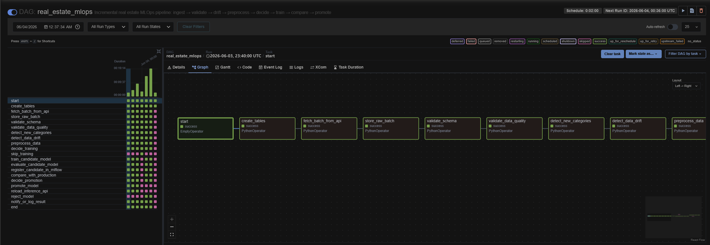

---

### API de inferencia (FastAPI)
Sirve predicciones de precio usando el modelo productivo registrado en MLflow. Soporta recarga en caliente del modelo sin reiniciar el contenedor y expone métricas para Prometheus. La API arranca incluso si no hay modelo disponible todavía — responde `503` hasta que el DAG promueve el primer modelo y llama a `POST /reload`.

> Ver documentación detallada: [api/README.md](api/README.md)

---

### Interfaz Streamlit
Dos secciones: formulario de predicción de precio por propiedad y vista del historial de entrenamiento y despliegue por lote (decisión de entrenamiento, métricas, identificadores MLflow).

> Ver documentación detallada: [streamlit/README.md](streamlit/README.md)

---

### MLflow
Servidor de tracking de experimentos y registro de modelos. Almacena métricas, parámetros y artefactos. El alias `production` determina qué versión sirve la API.

| Componente | Imagen |
|---|---|
| Servidor MLflow | `bravosjs/mlops-mlflow:dev` |
| Base de datos | `postgres:13` |
| Artefactos | MinIO — bucket `mlflows3` |

---

### MinIO
Almacenamiento de objetos compatible con S3. Guarda los artefactos de MLflow (modelos serializados) y los datos del proyecto.

| Bucket | Uso |
|---|---|
| `mlflows3` | Artefactos de MLflow (modelos, métricas, artefactos) |
| `real-estate-project` | Datos del proyecto |

---

### Observabilidad

| Servicio | Puerto | Descripción |
|---|---|---|
| Prometheus | 9090 | Scraping de métricas de la API cada 15s |
| Grafana | 3000 | Dashboard con RPS, latencia (p50/p95/p99), tasa de error |
| Locust | 8089 | Pruebas de carga sobre `POST /predict` |

---

## 3. Estructura del proyecto

```
Proyecto_3/
├── Airflow/                    ← DAG y configuración de Airflow
│   ├── dags/
│   │   ├── data_dag.py         ← DAG principal del pipeline MLOps
│   │   └── utils/              ← módulos del DAG (ingesta, training, drift, etc.)
│   ├── Dockerfile              ← imagen de producción (DAGs baked in)
│   ├── Dockerfile.Compose      ← imagen local (DAGs montados como volumen)
│   └── README.md
│
├── api/                        ← FastAPI inference API
│   ├── app/
│   │   ├── config.py
│   │   ├── schemas.py          ← PropertyFeatures + parseo de fechas
│   │   ├── database.py         ← inference_logs + batch_history
│   │   ├── model.py            ← carga desde MLflow
│   │   └── router.py           ← endpoints
│   ├── Dockerfile
│   └── README.md
│
├── streamlit/                  ← interfaz web
│   ├── app.py
│   ├── Dockerfile
│   └── README.md
│
├── grafana/                    ← imagen custom con dashboards baked in
│   ├── Dockerfile
│   ├── dashboards/
│   └── provisioning/
│
├── prometheus/                 ← imagen custom con prometheus.yml baked in
│   └── Dockerfile
│
├── locust/                     ← imagen custom con locustfile.py baked in
│   └── Dockerfile
│
├── mlflow/                     ← imagen custom de MLflow
│   └── Dockerfile
│
├── compose/                    ← compose files por servicio
│   ├── airflow-slim.yml
│   ├── api.yml
│   ├── api_source.yml
│   ├── grafana.yml
│   ├── locust.yml
│   ├── minio.yml
│   ├── mlflow.yml
│   ├── postgres-dataset.yml
│   ├── prometheus.yml
│   └── streamlit.yml
│
├── manifests/                  ← manifiestos de Kubernetes
│   ├── namespaces/             ← mlops-infra, mlops-app, mlops-obs, mlops-airflow
│   ├── infra/                  ← postgres-dataset, minio, mlflow, api-source, adminer
│   ├── app/                    ← api, streamlit
│   ├── obs/                    ← prometheus, grafana, locust
│   └── airflow-helm-values/
│       └── values-local.yaml
│
├── docker-compose.yaml         ← compose unificado (incluye todos los servicios)
├── Makefile                    ← despliegue por etapas en Kubernetes
└── README.md
```

---

## 4. Prerrequisitos

**Local (Docker Compose):**
- Docker Desktop ≥ 4.x con al menos 6 GB de RAM asignados
- `docker compose` v2

**Kubernetes:**
- Docker Desktop con Kubernetes habilitado (o kind/minikube)
- `kubectl` configurado
- `helm` ≥ 3.x (`brew install helm`)

**CI/CD:**
- Cuenta en DockerHub
- Secretos `DOCKERHUB_USERNAME` y `DOCKERHUB_TOKEN` configurados en GitHub → Settings → Secrets

---

## 5. Despliegue local — Docker Compose

### Levantar el stack completo

```bash
docker compose up -d --build
```

### Levantar servicios individuales

```bash
# Solo infraestructura
docker compose -f compose/postgres-dataset.yml -f compose/minio.yml -f compose/mlflow.yml up -d

# API de inferencia
docker compose -f compose/api.yml up -d --build

# Observabilidad
docker compose -f compose/prometheus.yml -f compose/grafana.yml up -d --build
```

### Variables de entorno requeridas (`.env` en `Proyecto_3/`)

```env
AIRFLOW_UID=50000
GF_ADMIN_USER=admin
GF_ADMIN_PASSWORD=admin
```

### Servicios disponibles

| Servicio | URL | Credenciales |
|---|---|---|
| Airflow | http://localhost:8080 | airflow / airflow |
| MLflow | http://localhost:5000 | — |
| API docs | http://localhost:8000/docs | — |
| Streamlit | http://localhost:8501 | — |
| Locust | http://localhost:8089 | — |
| Prometheus | http://localhost:9090 | — |
| Grafana | http://localhost:3000 | admin / admin |
| MinIO UI | http://localhost:9001 | minioadmin / minioadmin |

---

## 6. Despliegue en Kubernetes

Los manifiestos están organizados en **4 namespaces** para aislar responsabilidades:

| Namespace | Componentes |
|---|---|
| `mlops-infra` | postgres-dataset, minio, mlflow, api-source, adminer |
| `mlops-app` | api (FastAPI), streamlit |
| `mlops-obs` | prometheus, grafana, locust |
| `mlops-airflow` | airflow (Helm chart) |

### Despliegue completo (GitOps — Argo CD)

El mecanismo principal de despliegue es **Argo CD**. Un único comando instala Argo, aplica el App-of-Apps y deja que Argo sincronice todo desde Git:

```bash
cd Proyecto_3
make deploy            # argocd-install + argocd-bootstrap + argocd-wait
make deploy-airflow    # Helm chart de Airflow (fuera de Argo)
make forward           # Port-forwards a localhost
```

### Despliegue por etapas (sin Argo — backup)

```bash
make namespaces          # Crea los 4 namespaces
make deploy-infra        # PostgreSQL, MinIO, MLflow, api-source
make wait-infra          # Espera a que infra esté lista
make minio-init          # Crea los buckets en MinIO
make deploy-app          # API de inferencia + Streamlit
make deploy-obs          # Prometheus + Grafana + Locust
make deploy-airflow      # Helm chart de Airflow + migraciones de DB
```

### Acceso local (port-forward)

```bash
make forward             # Abre todos los servicios en localhost
make forward-adminer     # Adminer en localhost:8082 (opcional)
make stop-forward        # Cierra todos los port-forwards
```

| Servicio | URL | Credenciales |
|---|---|---|
| Airflow | http://localhost:8080 | airflow / airflow |
| MLflow | http://localhost:5000 | — |
| API docs | http://localhost:8000/docs | — |
| Streamlit | http://localhost:8501 | — |
| Locust | http://localhost:8089 | — |
| Prometheus | http://localhost:9090 | — |
| Grafana | http://localhost:3000 | admin / admin |
| MinIO UI | http://localhost:9001 | minioadmin / minioadmin |
| Argo CD UI | https://localhost:8083 | admin / `make argocd-password` |

### Otros targets útiles

```bash
make status              # Estado de pods y servicios en todos los namespaces
make restart-api         # Rollout restart de la API
make restart-airflow     # Rollout restart del scheduler y webserver de Airflow
make airflow-migrate     # Re-corre las migraciones de Airflow (útil tras reinstalar)
make delete-app          # Elimina mlops-app, mlops-obs y mlops-airflow
make delete              # Elimina todos los namespaces (destruye todo)
```

---

## 7. GitOps — Argo CD

El flujo GitOps con Argo CD es el **mecanismo principal de despliegue**. Cualquier cambio en los manifiestos de Git (incluyendo nuevas etiquetas de imagen generadas por CI/CD) se sincroniza automáticamente con el clúster.

### Patrón App-of-Apps

Se usa el patrón **App-of-Apps**: una `Application` raíz (`mlops-root`) gestiona un conjunto de `Application`s hijas, una por capa del sistema, ordenadas con *sync-waves*:

| Wave | Application | Path en Git | Namespace destino |
|---|---|---|---|
| 0 | `mlops-namespaces` | `manifests/namespaces/` | (crea los 4 namespaces) |
| 1 | `mlops-infra` | `manifests/infra/` | `mlops-infra` |
| 2 | `mlops-app` | `manifests/app/` | `mlops-app` |
| 2 | `mlops-obs` | `manifests/obs/` | `mlops-obs` |
| 3 | `mlops-airflow` | Helm chart oficial | `mlops-airflow` |

```
manifests/argocd/
├── project.yaml              ← AppProject "mlops"
├── root-app.yaml             ← Application raíz (App-of-Apps)
└── applications/
    ├── 00-namespaces.yaml    ← Wave 0
    ├── 10-infra.yaml         ← Wave 1
    ├── 20-app.yaml           ← Wave 2
    ├── 20-obs.yaml           ← Wave 2
    └── 30-airflow.yaml       ← Wave 3 (multi-source: chart + values de Git)
```

El init de buckets de MinIO (`minio-init`) corre como **hook PostSync** de Argo y se autoelimina al terminar.

**Airflow** se despliega mediante una `Application` multi-source: el chart oficial desde el repo de Helm de Apache y el archivo `values-local.yaml` desde Git. Esto permite versionar los valores de Helm junto al resto del proyecto.

### Configuración de sincronización

Todas las `Application`s tienen `prune` y `selfHeal` activados:

- **`prune: true`** — elimina del clúster los recursos que ya no existen en Git.
- **`selfHeal: true`** — revierte cualquier cambio manual en el clúster que no esté en Git.
- La rama de seguimiento es `feature/proyecto3_airflow`.

### Bootstrap (único paso manual)

```bash
make argocd-install       # Instala Argo CD en el namespace argocd (--server-side)
make argocd-bootstrap     # Aplica project.yaml + root-app.yaml → Argo sincroniza todo
make deploy-airflow       # Airflow vía Helm (iniciado por la Application wave-3)
```

### Comandos de Argo CD

```bash
make argocd-forward       # UI en https://localhost:8083
make argocd-password      # Muestra la contraseña inicial del usuario admin
make argocd-status        # Estado de todas las Applications
make argocd-wait          # Espera a que todas las Applications estén Synced + Healthy
```

### Dashboard de Argo CD — evidencia

Vista general de la UI de Argo CD con las Applications desplegadas y sincronizadas:

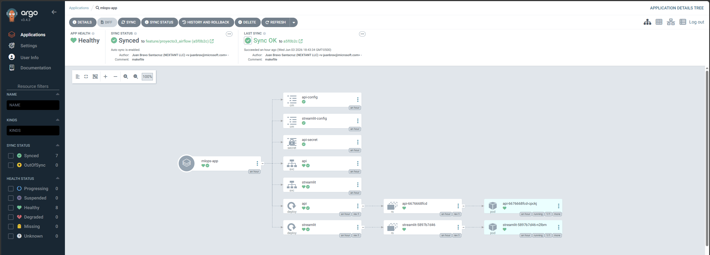

Dashboard de Argo CD mostrando todas las Applications en estado `Synced` y `Healthy`:

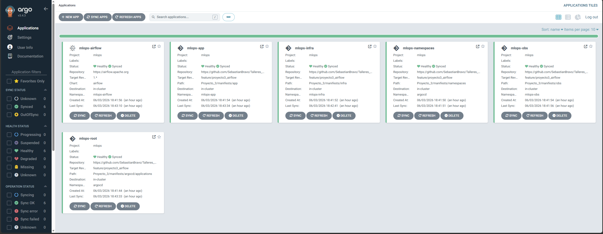

Sincronización automática de Argo CD después de que GitHub Actions publica una nueva imagen (el CI/CD actualiza la etiqueta en los manifiestos y Argo detecta el cambio en Git):

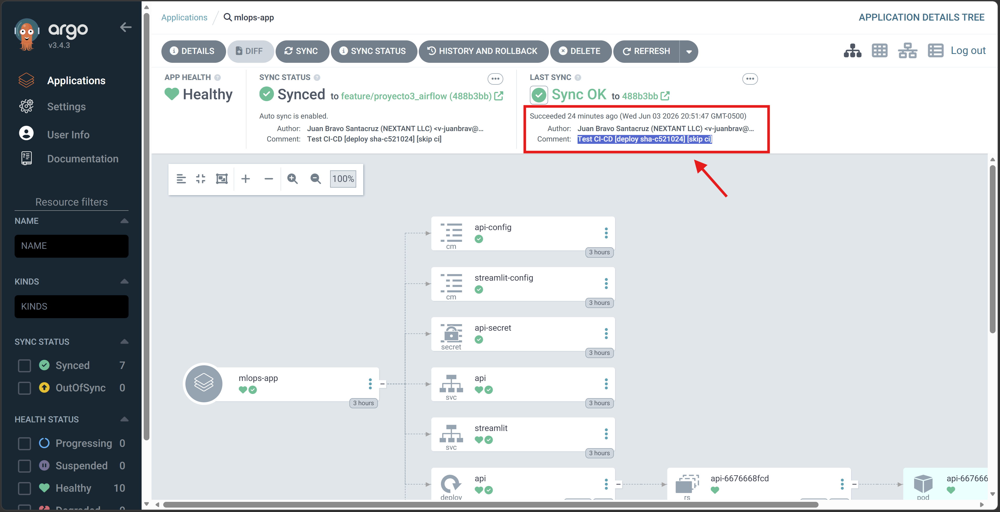

### Gestión de recursos — `pipeline-mode` y `full-mode`

En entornos con RAM limitada (Docker Desktop), se pueden apagar temporalmente los servicios de observabilidad y Argo CD mientras el DAG procesa lotes, y restaurarlos después:

```bash
# Apaga: Streamlit, Prometheus, Grafana, Locust y todos los componentes de Argo CD.
# La API de inferencia se mantiene activa porque el DAG la usa.
make pipeline-mode

# Restaura: sube Argo CD, reactiva selfHeal y vuelve a levantar todos los servicios.
make full-mode
```

> `pipeline-mode` desactiva primero `selfHeal` en Argo antes de escalar a 0 para evitar
> que Argo intente reparar los deployments mientras se apagan.

### Imágenes Docker (DockerHub)

| Imagen | Tag estable | Descripción |
|---|---|---|
| `bravosjs/mlops-api` | `dev` / `sha-*` | FastAPI inference API |
| `bravosjs/mlops-streamlit` | `dev` / `sha-*` | Interfaz Streamlit |
| `bravosjs/mlops-airflow` | `dev` / `sha-*` | Airflow con DAGs baked in |
| `bravosjs/mlops-airflow-compose` | `dev` / `sha-*` | Airflow para uso local con volúmenes |
| `bravosjs/mlops-mlflow` | `dev` / `sha-*` | MLflow tracking server |
| `bravosjs/mlops-prometheus` | `dev` / `sha-*` | Prometheus con config baked in |
| `bravosjs/mlops-grafana` | `dev` / `sha-*` | Grafana con dashboards baked in |
| `bravosjs/mlops-locust` | `dev` / `sha-*` | Locust con locustfile baked in |

---

## 8. CI/CD — GitHub Actions

Cinco workflows en `.github/workflows/` construyen y publican imágenes multi-arquitectura (`linux/amd64` + `linux/arm64`) en DockerHub.

| Workflow | Disparo | Imágenes |
|---|---|---|
| `build-api.yml` | Cambios en `Proyecto_3/api/**` | `mlops-api` |
| `build-streamlit.yml` | Cambios en `Proyecto_3/streamlit/**` | `mlops-streamlit` |
| `build-airflow.yml` | Cambios en `Proyecto_3/Airflow/**` | `mlops-airflow` + `mlops-airflow-compose` |
| `build-mlflow.yml` | Cambios en `Proyecto_3/mlflow/**` | `mlops-mlflow` |
| `build-observability.yml` | Cambios en `prometheus/`, `grafana/`, `locust/` | `mlops-prometheus`, `mlops-grafana`, `mlops-locust` |

**Estrategia de tags:**
- Cualquier push: `sha-<7chars>` (trazabilidad exacta al commit)
- Push a `main`: + `latest`
- Push a rama `feature/**`: + `dev`
- Pull Request: solo build local, sin push (valida que compila en ambas arquitecturas)

**Secretos requeridos en GitHub:**

```
DOCKERHUB_USERNAME
DOCKERHUB_TOKEN    ← access token (no la contraseña)
```

**Flujo CI/CD → GitOps:** al publicar una nueva imagen con tag `sha-*` o `dev`, los manifiestos de Kubernetes se actualizan con la nueva etiqueta. Argo CD detecta el cambio en Git y sincroniza automáticamente el clúster.

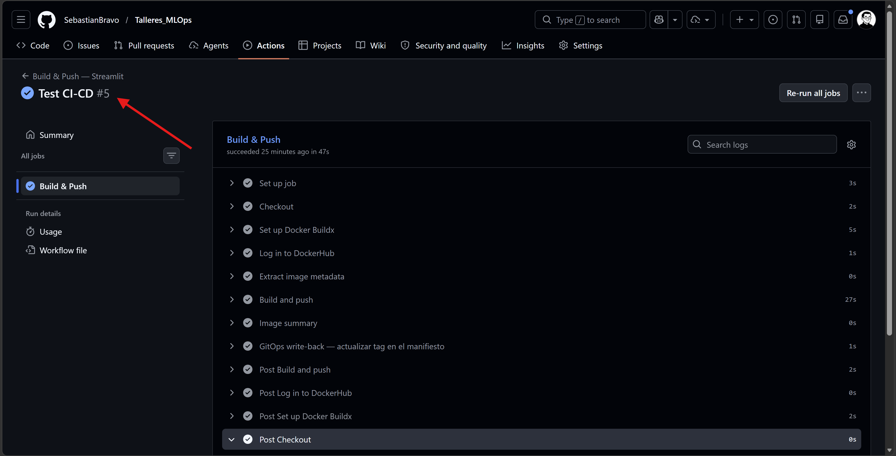

## 9. Flujo del pipeline MLOps

El DAG `real_estate_mlops` ejecuta el siguiente pipeline de forma incremental cada 2 minutos:

```
Cada 2 minutos (schedule del DAG):

  1. fetch_batch_from_api     ← GET /data?group_number=7
  2. store_raw_batch          ← INSERT en property_raw + audit entry
  3. validate_schema          ← verifica columnas requeridas
  4. validate_data_quality    ← nulls, duplicados, rangos
  5. detect_new_categories    ← nuevas categorías en city, state, etc.
  6. detect_data_drift        ← KS test vs. distribución histórica
  7. preprocess_data          ← ColumnTransformer + split train/val/test
  8. decide_training ─┬─ NO → skip_training
     (BranchOperator)  └─ SÍ → train_candidate_model
                                   │
                           evaluate_candidate_model
                                   │
                           register_candidate_in_mlflow
                                   │
                           compare_with_production
                                   │
                    decide_promotion ─┬─ NO → reject_model
                                      └─ SÍ → promote_model
                                                  │
                                          reload_inference_api
                                          (POST /reload)
  9. notify_or_log_result     ← marca el batch como "success"
```

**Criterios de entrenamiento** (cualquiera dispara reentrenamiento):
- No existe modelo productivo (baseline inicial)
- Volumen del batch ≥ 10% del histórico acumulado
- Nuevas categorías significativas (frecuencia ≥ 1%)
- Drift en distribución (KS test, p < 0.05)

**Criterio de promoción:**
- MAE del candidato mejora ≥ 3% frente al modelo productivo
- Si no existe modelo previo, se promueve automáticamente como baseline

### Evidencia del DAG en ejecución

Vista general del historial de ejecuciones del DAG en la UI de Airflow. Cada fila es un lote de datos procesado:


Ejemplo de una ejecución donde se **entrena, evalúa y promueve o rechaza** el modelo candidato:

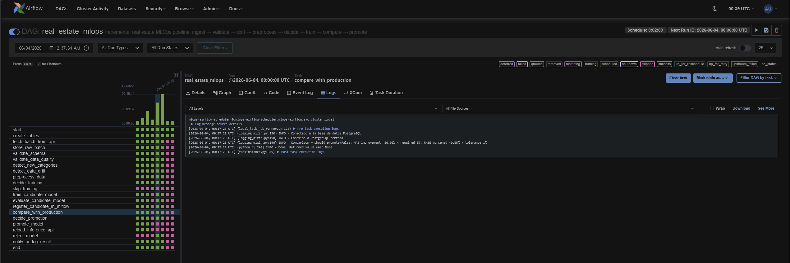

Ejemplo de una ejecución donde el DAG decide **omitir el entrenamiento** porque ningún criterio técnico lo requiere:

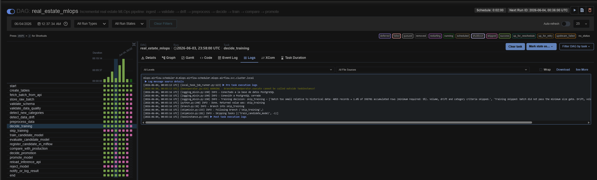

> Para la descripción completa de cada tarea, criterios de branching, esquema de tablas y manejo de errores, ver [Airflow/README.md](Airflow/README.md).

---

## 10. Interfaz web — Streamlit

La interfaz Streamlit (`localhost:8501`) tiene dos secciones principales:

**Sección 1 — Predicción de precio:** formulario con todos los campos de una propiedad inmobiliaria. El usuario completa los datos y la interfaz llama a `POST /predict` de la API de inferencia.

**Sección 2 — Historial de entrenamiento:** tabla con el registro de cada lote procesado por el DAG: si se entrenó, métricas del modelo, versión en MLflow, decisión de promoción y fecha.

> Para más detalles sobre la interfaz, ver [streamlit/README.md](streamlit/README.md).

### Evidencia

Vista general de la interfaz con el formulario de predicción:

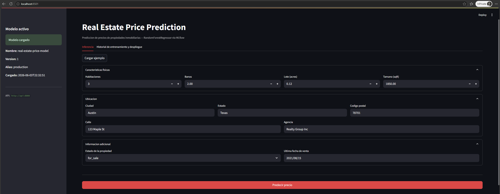

Ejemplo de una predicción realizada desde el formulario:

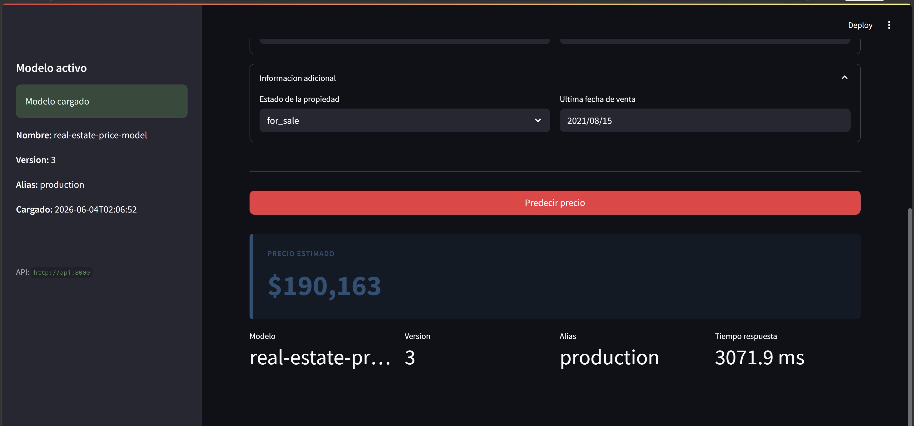

Historial de entrenamiento sin refrescar (estado inicial al cargar la página):

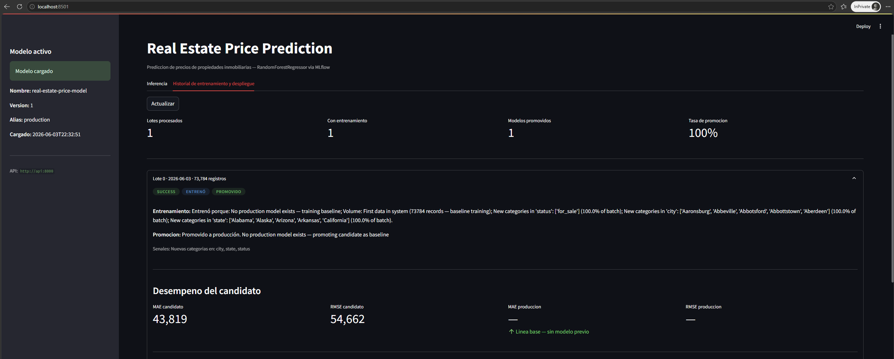

Historial de entrenamiento después de refrescar — muestra los lotes más recientes procesados por el DAG:

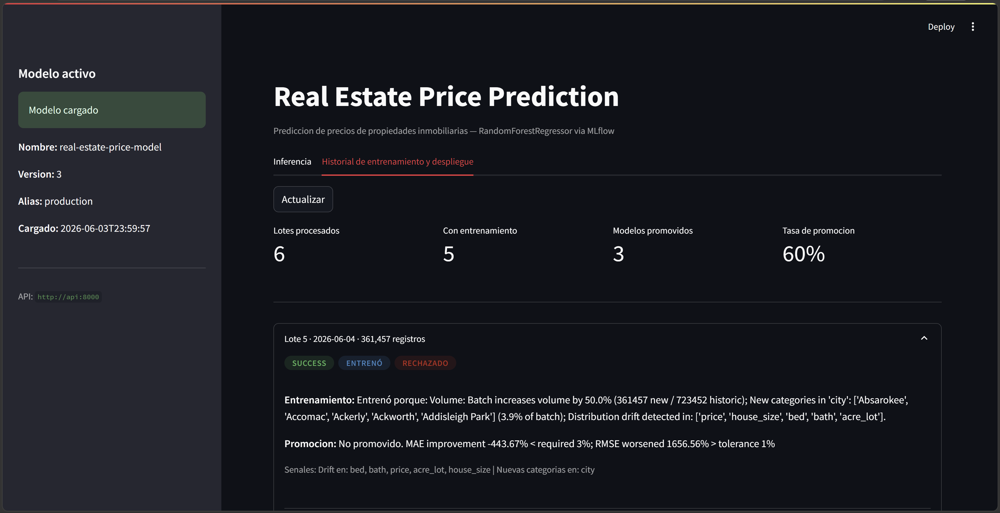

---

## 11. Observabilidad — Grafana & Prometheus

Prometheus hace scraping de las métricas expuestas por la API (`GET /metrics`) cada 15 segundos. Grafana las visualiza en un dashboard preconfigurado que incluye:

- **Requests per second (RPS):** tasa de peticiones totales y por endpoint.
- **Latencia:** percentiles p50, p95 y p99 de tiempo de respuesta.
- **Tasa de error:** proporción de respuestas 4xx/5xx.
- **Predicciones totales:** contador de inferencias realizadas.

Los dashboards de Grafana están **baked into la imagen Docker** (`bravosjs/mlops-grafana:dev`), por lo que arrancan preconfigurados sin intervención manual.

### Evidencia

Dashboard de Grafana en estado normal de operación:

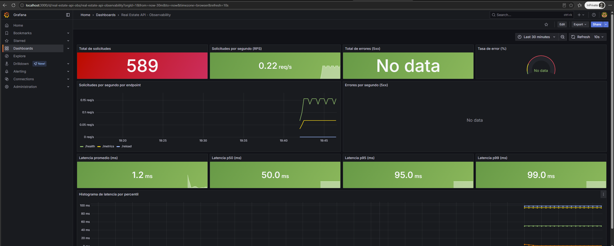

Dashboard de Grafana durante una sesión de pruebas de carga con Locust (se puede observar el pico en RPS y latencia):

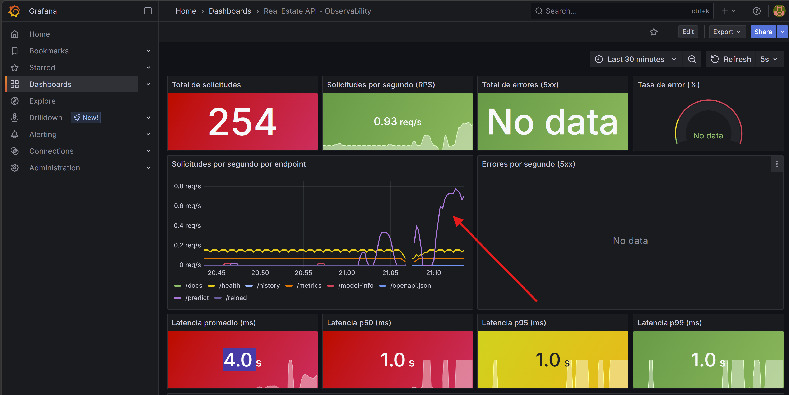

---

## 12. Pruebas de carga — Locust

Locust (`localhost:8089`) permite simular múltiples usuarios concurrentes haciendo peticiones a `POST /predict`. Se utiliza para:

- Validar que la API soporta carga sostenida sin degradación.
- Medir la latencia bajo distintos niveles de concurrencia.
- Identificar cuellos de botella antes de producción.

El `locustfile.py` está **baked into la imagen Docker** (`bravosjs/mlops-locust:dev`) junto con un payload de prueba realista.

### Evidencia

Resultados de una sesión de pruebas de carga en la UI de Locust:

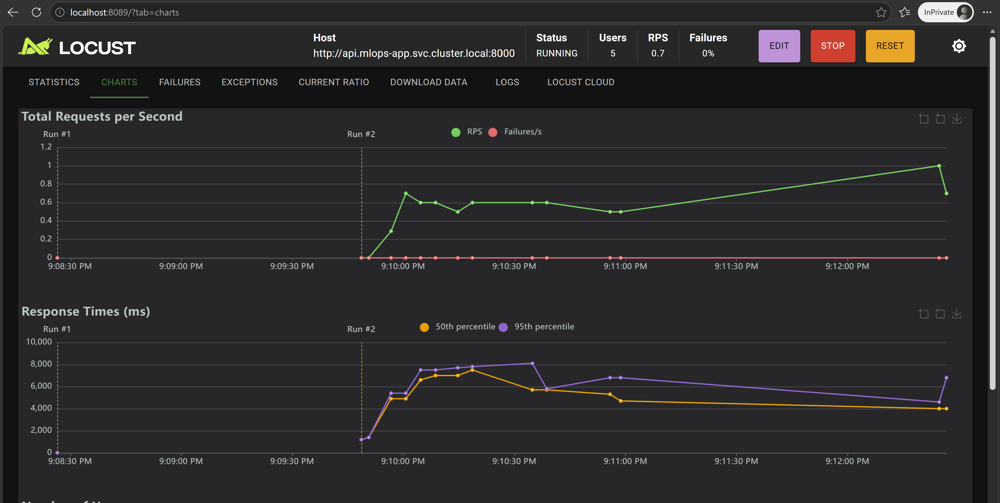

---

## 13. MLflow — Tracking y Registry

MLflow cumple dos roles en el sistema:

**Tracking:** cada ejecución de entrenamiento registra métricas (`mae`, `rmse`, `r2`), parámetros del modelo (hiperparámetros de RandomForest, número de muestras), tags del batch (número, fecha) y artefactos (el pipeline serializado).

**Registry:** el modelo promovido recibe el alias `production`. La API de inferencia carga el modelo por alias, por lo que una nueva promoción actualiza automáticamente el modelo servido sin tocar el código.

### Evidencia

Vista general del panel de experimentos de MLflow con el historial de runs:

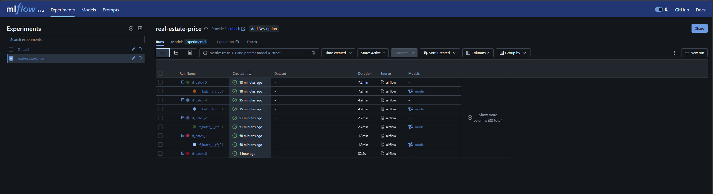

Ejemplo de métricas y tags registrados en un experimento individual:

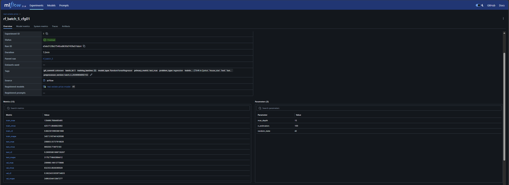

Visualización de gráficas y artefactos de un experimento:

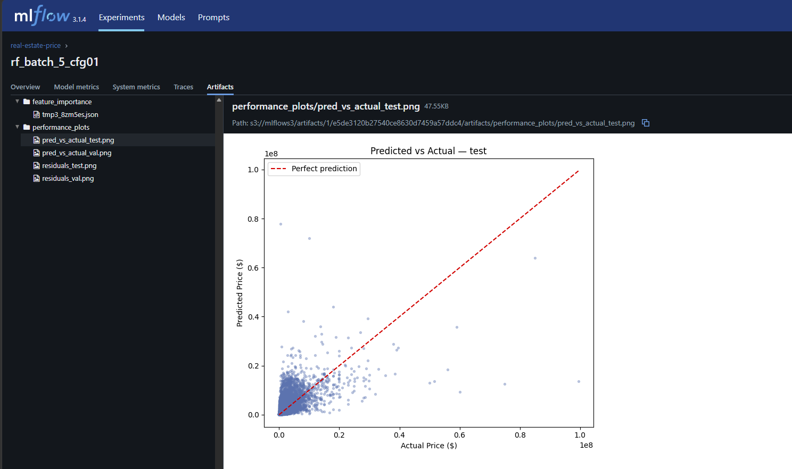

---

## 14. Gestión de recursos en Kubernetes

En entornos con recursos limitados (Docker Desktop con 8–12 GB de RAM), el stack completo puede consumir demasiada memoria durante los ciclos intensivos del DAG. Para mitigarlo existe un par de targets en el `Makefile`:

### `make pipeline-mode`

Libera RAM apagando los servicios no esenciales mientras el DAG procesa lotes. La API de inferencia **permanece activa** porque el DAG la llama en cada ciclo.

**Qué apaga:**
- Streamlit (`mlops-app`)
- Prometheus, Grafana, Locust (`mlops-obs`)
- Todos los componentes de Argo CD (`argocd`)

**Orden de operaciones:**
1. Desactiva `selfHeal` en las Applications de Argo antes de escalar a 0 (evita que Argo intente restaurar los recursos mientras se apagan).
2. Escala a 0 los deployments de Streamlit y observabilidad.
3. Escala a 0 todos los componentes de Argo CD.

```bash
make pipeline-mode
# → Modo pipeline activo. Corren: infra + api + airflow.
# → Cuando el DAG termine, ejecuta: make full-mode
```

### `make full-mode`

Restaura el stack completo en orden inverso:

1. Sube todos los componentes de Argo CD y espera a que estén disponibles.
2. Reactiva `selfHeal` en las Applications.
3. Sube Streamlit y toda la pila de observabilidad.

```bash
make full-mode
# → Modo completo activo. Todos los servicios disponibles.
# → Levanta los port-forwards con: make forward
```
