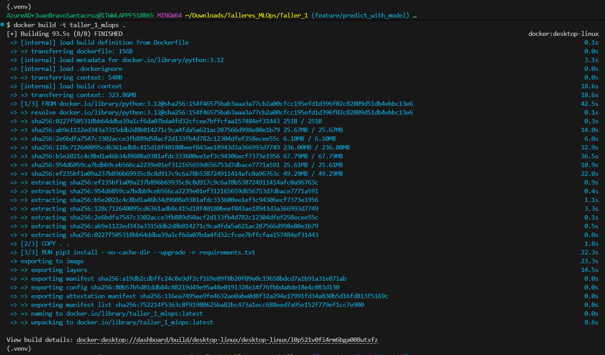
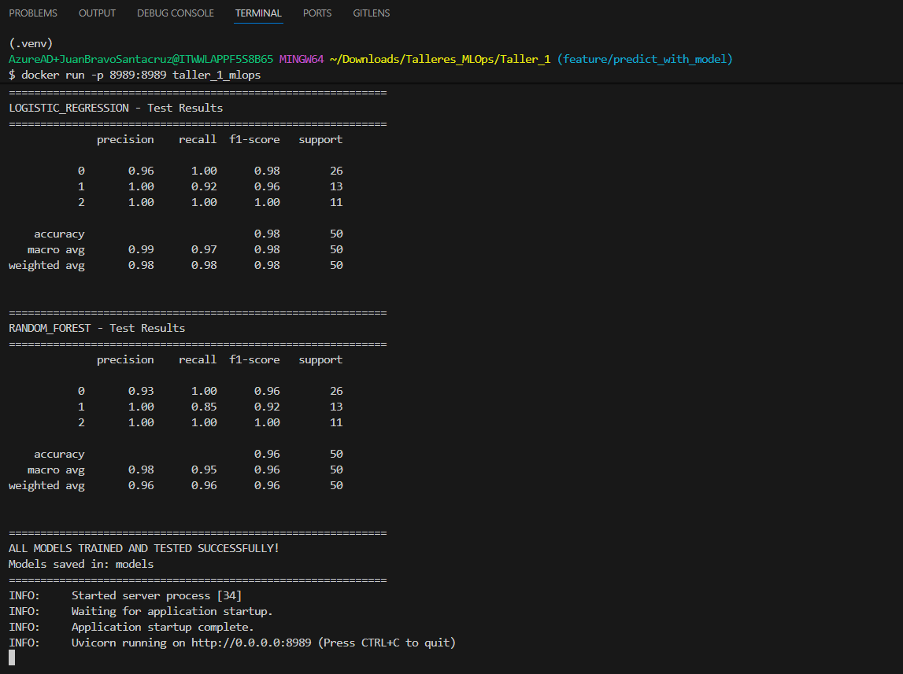
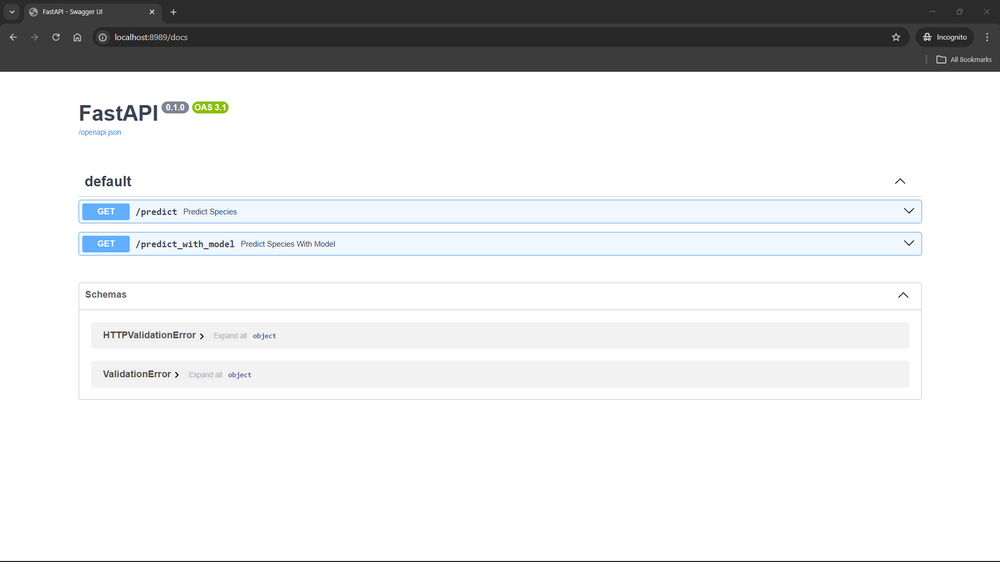
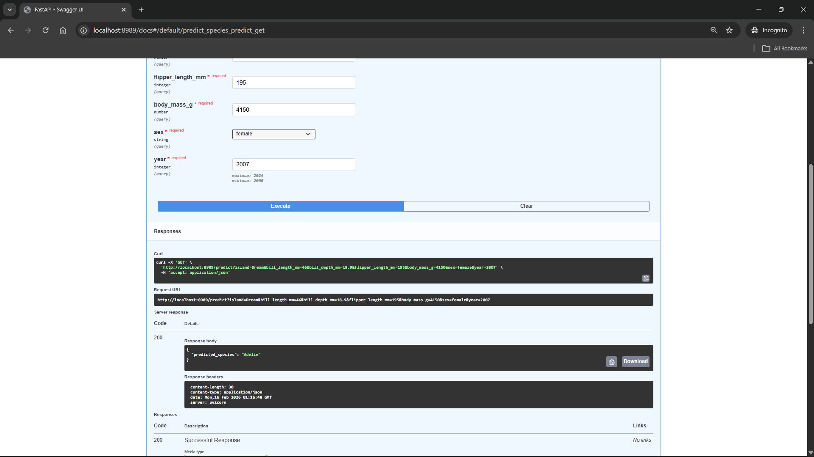
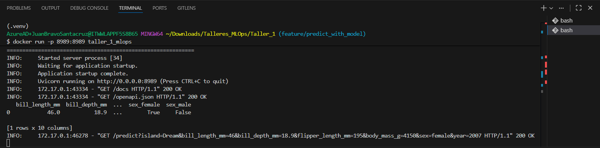
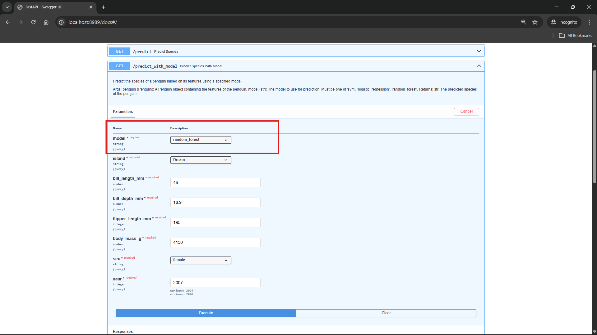
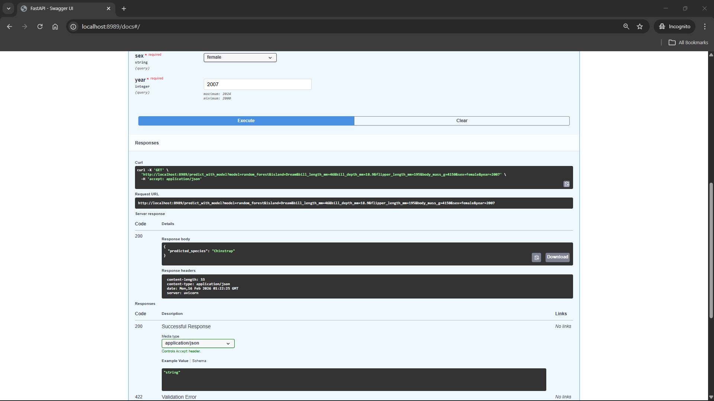
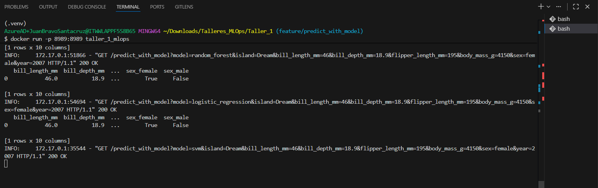

# Taller 1 - MLOps: Clasificación de Pingüinos con FastAPI y Docker

Este proyecto implementa un sistema de clasificación de especies de pingüinos utilizando Machine Learning, FastAPI y Docker.

## Descripción del Proyecto

### 1. Entrenamiento de Modelos (`train.py`)

Se creó un archivo `train.py` que entrena **3 modelos de clasificación** diferentes a partir del dataset **Palmer Penguins**:

- **Support Vector Machine (SVM)**
- **Regresión Logística (Logistic Regression)**
- **Random Forest (Bosque Aleatorio)**

Estos modelos se entrenan con las características de los pingüinos (longitud del pico, profundidad del pico, longitud de la aleta, masa corporal, isla, sexo y año) para predecir su especie (Adelie, Chinstrap o Gentoo). Los modelos entrenados se guardan en la carpeta `models/` en formato `.pkl` utilizando `joblib`.

Así mismo el script siguientes etapas sobre los datos:

- Carga
- Limpieza
- Transformación
- Validación
- Ingeniería de Características
- División

Por otro lado, la creación de cada modelo consta de los pasos:

- Construcción
- Entrenamiento
- Validación

### 2. API REST con FastAPI (`api.py`)

Se desarrolló una API REST utilizando **FastAPI** que expone endpoints para realizar predicciones de especies de pingüinos.

#### Modelo de Datos Penguin

La API utiliza un modelo de datos `Penguin` (Pydantic BaseModel) que valida los siguientes campos:
- `island`: Isla donde fue observado (Biscoe, Dream, Torgersen)
- `bill_length_mm`: Longitud del pico en milímetros
- `bill_depth_mm`: Profundidad del pico en milímetros
- `flipper_length_mm`: Longitud de la aleta en milímetros
- `body_mass_g`: Masa corporal en gramos
- `sex`: Sexo del pingüino (male, female)
- `year`: Año de observación

#### Endpoints Disponibles

**GET `/predict`**
- Realiza la clasificación utilizando el modelo SVM por defecto
- Recibe los parámetros del pingüino como query parameters
- Retorna la especie predicha

**Bonus - GET `/predict_with_model`**
- Permite seleccionar el modelo de clasificación deseado
- Parámetro de consulta `model`: puede ser `svm`, `logistic_regression` o `random_forest`
- Recibe los parámetros del pingüino como query parameters
- Retorna la especie predicha usando el modelo seleccionado

### 3. Dockerización del Proyecto

El proyecto fue **dockerizado** para facilitar su despliegue y portabilidad.

#### Archivos de Configuración Docker

**`Dockerfile`**
- Define la imagen base de Python
- Instala las dependencias del proyecto
- Copia los archivos necesarios
- Configura el entrypoint para ejecutar el script de inicio

**`entrypoint.sh`**
- Script de inicio que se ejecuta al iniciar el contenedor
- Primero ejecuta `train.py` para entrenar los modelos
- Posteriormente levanta la API con Uvicorn en el puerto **8989**

**`requirements.txt`**
- Contiene todas las dependencias necesarias del proyecto:
  - fastapi
  - uvicorn
  - pandas
  - scikit-learn
  - joblib
  - pydantic
  - etc.

**`.dockerignore`**
- Evita que archivos innecesarios se suban a la imagen Docker
- Excluye carpetas como `__pycache__`, `.git`, archivos de configuración locales, etc.

### 4. Construcción y Ejecución del Contenedor

#### Construcción de la Imagen

```bash
docker build -t taller_1_mlops .
```

#### Ejecución del Contenedor

```bash
docker run -p 8989:8989 taller_1_mlops
```

#### Ejecución del Contenedor en segundo plano

```bash
docker run -p 8989:8989 -d taller_1_mlops
```

El comando anterior:
- Mapea el puerto **8989** del contenedor al puerto **8989** del host
- Ejecuta el entrypoint que entrena los modelos y levanta la API
- La API queda disponible en `http://localhost:8989`

#### Documentación Interactiva

Una vez en ejecución, se puede acceder a:
- **Swagger UI**: `http://localhost:8989/docs`
- **ReDoc**: `http://localhost:8989/redoc`

---

## Pruebas de Funcionamiento

### Evidencia de Ejecución

_A continuación se muestran los screenshots que demuestran el correcto funcionamiento del proyecto:_

#### 1. Construcción exitosa de la imagen Docker



#### 2. Ejecución del contenedor

Aquí se puede apreciar que antes de iniciar el API, en consola se presenta la salida de train.py



Al entrar a [http://localhost:8989/docs](http://localhost:8989/docs) se puede apreciar la interfaz de FastAPI con los 2 métodos implementados:



#### 3. Prueba del endpoint `/predict`

Se realizó la prueba del primer método:



Así mismo, se observó la petición en la terminal



#### 4. Prueba del endpoint `/predict_with_model` con diferentes modelos

Se probó el método con selección de modelo con svm, random_forest y logistic_regression:








## Estructura del Proyecto

```
Taller_1/
├── api.py                  # API FastAPI con endpoints de predicción
├── train.py                # Script de entrenamiento de modelos
├── Dockerfile              # Definición de la imagen Docker
├── entrypoint.sh           # Script de inicio del contenedor
├── requirements.txt        # Dependencias del proyecto
├── .dockerignore           # Archivos excluidos de la imagen
├── test_sample.csv         # Datos de prueba
├── models/                 # Modelos entrenados (.pkl)
├── img/                    # Imágenes documentación
└── README.md               # Este archivo
```

---

## Tecnologías Utilizadas

- **Python 3.x**
- **FastAPI** - Framework web moderno para APIs
- **Uvicorn** - Servidor ASGI
- **Scikit-learn** - Biblioteca de Machine Learning
- **Pandas** - Manipulación de datos
- **Pydantic** - Validación de datos
- **Docker** - Contenedorización
- **Palmer Penguins Dataset** - Conjunto de datos de pingüinos

---

## Conclusión

Este proyecto demuestra la implementación completa de un pipeline de MLOps básico que incluye:
- Entrenamiento de múltiples modelos de clasificación
- Exposición de modelos mediante una API REST
- Validación de datos de entrada
- Dockerización para despliegue reproducible
- Documentación automática de la API
