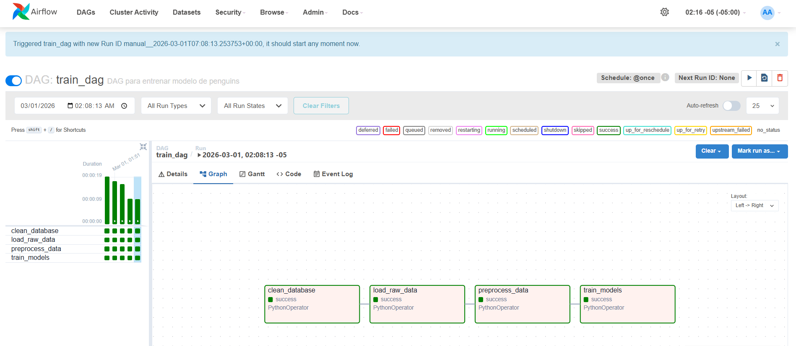
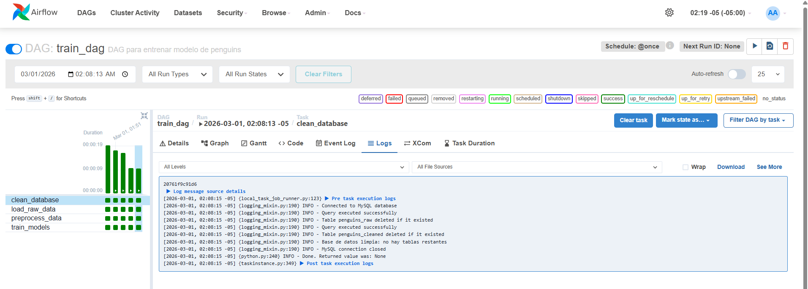
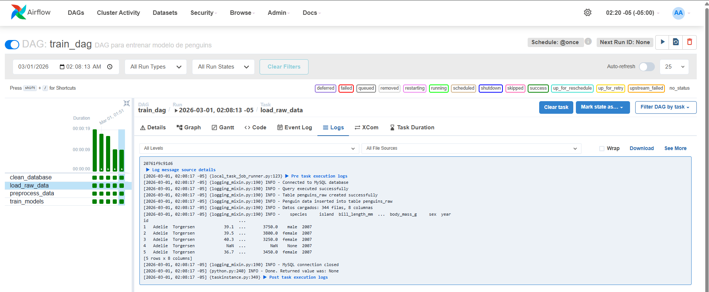
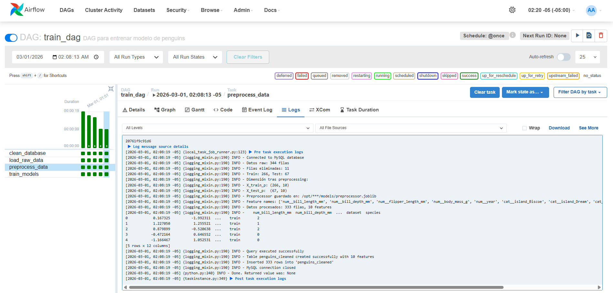
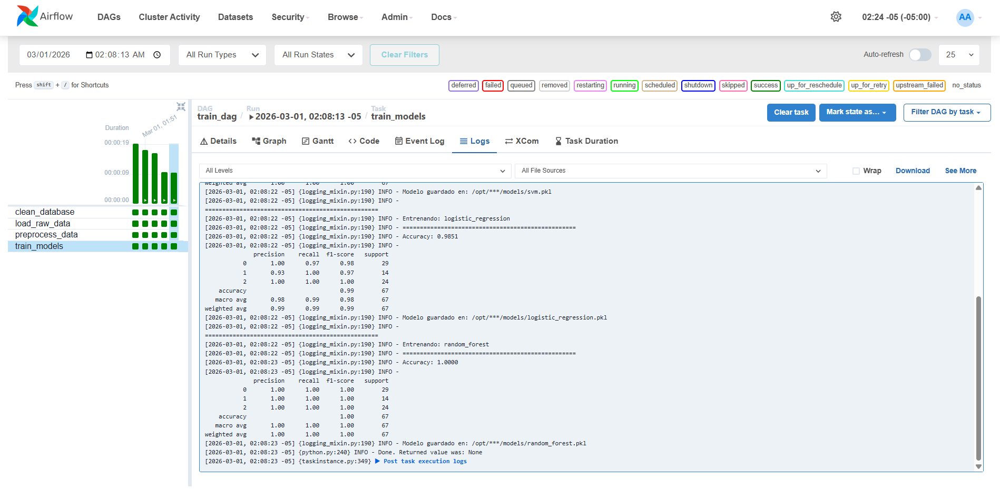
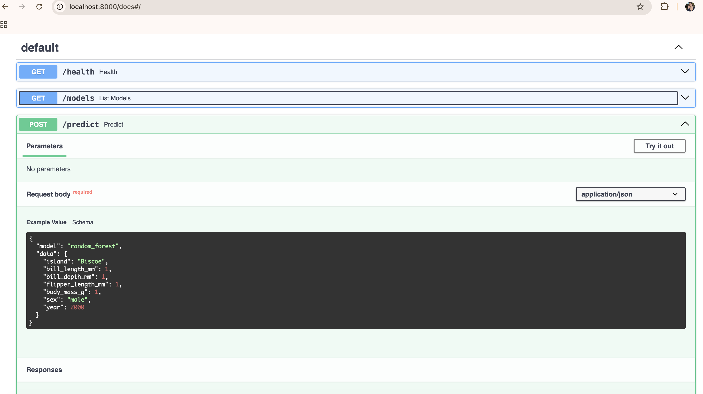
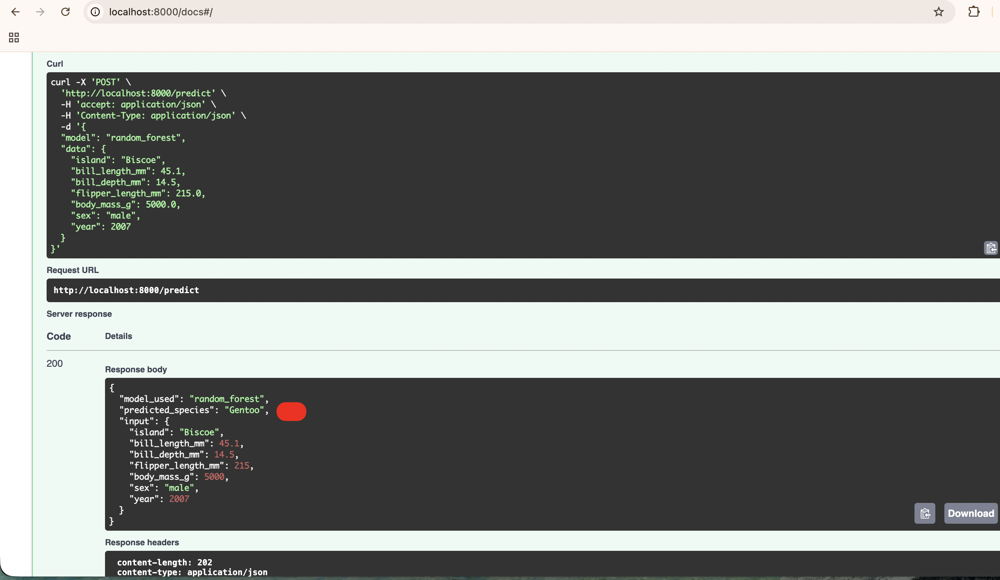

# Taller 3 - MLOps: Pipeline de ML con Apache Airflow, MySQL y FastAPI

Este proyecto implementa un pipeline completo de Machine Learning orquestado con Apache Airflow, utilizando Docker Compose para desplegar todos los servicios: base de datos exclusiva para datos (MySQL), metadata de Airflow (PostgreSQL), entrenamiento de modelos y API de inferencia.

## Descripcion del Proyecto

### 1. Infraestructura con Docker Compose

Todos los servicios corren en el mismo `docker-compose.yaml`:

| Servicio | Imagen | Proposito | Puerto |
|---|---|---|---|
| **mysql_db** | mysql:8.0 | Base de datos exclusiva para datos (penguins) | 3306 |
| **postgres** | postgres:13 | Metadata de Airflow (DAG runs, task instances) | 5432 |
| **redis** | redis:7.2 | Broker de mensajes para CeleryExecutor | 6379 |
| **airflow-webserver** | Custom | Interfaz web de Airflow | 8080 |
| **airflow-scheduler** | Custom | Programador de tareas | - |
| **airflow-worker** | Custom | Ejecutor de tareas via Celery | - |
| **airflow-triggerer** | Custom | Triggers asincronos | - |
| **airflow-init** | Custom | Inicializacion de BD y usuario admin | - |
| **api** | Custom | API FastAPI para inferencia | 8000 |

La separacion de bases de datos garantiza que MySQL es **exclusiva para datos del proyecto** y PostgreSQL maneja unicamente la metadata de Airflow.

### 2. DAG de Entrenamiento (`train_dag`)

El DAG `train_dag` orquesta el pipeline completo de ML con 4 tareas secuenciales:

**`clean_database`** -> **`load_raw_data`** -> **`preprocess_data`** -> **`train_models`**



#### Tarea 1: Borrar contenido de la base de datos

Elimina las tablas `penguins_raw` y `penguins_cleaned` para ejecutar el pipeline desde cero. Verifica que la base de datos quede limpia.



#### Tarea 2: Cargar datos crudos sin preprocesamiento

Carga el dataset Palmer Penguins (344 filas) directamente a la tabla `penguins_raw` en MySQL, incluyendo valores nulos, sin ningun preprocesamiento.



#### Tarea 3: Preprocesamiento de datos

Lee los datos crudos de `penguins_raw`, aplica las siguientes transformaciones y guarda en `penguins_cleaned`:

1. **Limpieza de datos**:
   - Eliminacion de filas con valores nulos (344 -> 333 filas)
   - Eliminacion de duplicados
   - Codificacion de `species` a numerico (Adelie=0, Chinstrap=1, Gentoo=2)

2. **Split train/test (80/20)** con estratificacion por especie antes del preprocesamiento para evitar data leakage

3. **Pipeline de preprocesamiento con sklearn**:
   - **Features numericas** (`bill_length_mm`, `bill_depth_mm`, `flipper_length_mm`, `body_mass_g`, `year`):
     - Imputacion con mediana (`SimpleImputer`)
     - Escalado estandar (`StandardScaler`)
   - **Features categoricas** (`island`, `sex`):
     - Imputacion con moda (`SimpleImputer`)
     - One-hot encoding (`OneHotEncoder`)
   - Utiliza `ColumnTransformer` para aplicar transformaciones especificas a cada tipo

4. **Fit y transform**:
   - El preprocessor se ajusta **solo con datos de train** (evita data leakage)
   - Se transforma train y test con el mismo preprocessor

5. **Persistencia**:
   - El preprocessor se guarda como `preprocessor.joblib` en el volumen compartido de models
   - Los datos procesados se guardan en `penguins_cleaned` con:
     - Nombres de features descriptivos (ej: `num_bill_length_mm`, `cat_island_Biscoe`)
     - Columna `dataset` indicando si es 'train' o 'test'
     - Columna `species` con el target numerico



#### Tarea 4: Entrenamiento de modelos

Lee los datos preprocesados de `penguins_cleaned`, filtra por el campo `dataset` (train/test), y entrena 3 modelos:

- **SVM** - kernel RBF, C=1.0
- **Logistic Regression** - max_iter=1000
- **Random Forest** - 100 estimadores

Cada modelo se evalua con accuracy y classification report sobre el conjunto de test, y se guarda como `.pkl` en el volumen compartido con los nombres `svm.pkl`, `logistic_regression.pkl` y `random_forest.pkl`.



### 3. API de Inferencia (FastAPI)

API REST que carga los modelos entrenados y el preprocessor guardado para clasificar especies de pinguinos.

**Pipeline de inferencia**:
1. Recibe datos crudos del pinguino (island, bill_length_mm, etc.)
2. Carga el `preprocessor.joblib` guardado durante el entrenamiento
3. Transforma los datos usando el mismo preprocesamiento que train
4. Aplica el modelo seleccionado para predecir la especie
5. Retorna la prediccion con el nombre de la especie

#### Modelo de Datos

| Campo | Tipo | Descripcion |
|---|---|---|
| `island` | Literal["Biscoe", "Dream", "Torgersen"] | Isla de observacion |
| `bill_length_mm` | float | Longitud del pico (mm) |
| `bill_depth_mm` | float | Profundidad del pico (mm) |
| `flipper_length_mm` | float | Longitud de la aleta (mm) |
| `body_mass_g` | float | Masa corporal (g) |
| `sex` | Literal["male", "female"] | Sexo |
| `year` | int | Ano de observacion |

#### Endpoints

- **GET `/health`** - Healthcheck del servicio
- **GET `/models`** - Lista los modelos entrenados disponibles y verifica si existe el preprocessor
- **POST `/predict`** - Predice la especie usando el modelo seleccionado y el preprocessor guardado

Ejemplo de request:

```json
{
  "model": "random_forest",
  "data": {
    "island": "Biscoe",
    "bill_length_mm": 45.1,
    "bill_depth_mm": 14.5,
    "flipper_length_mm": 215,
    "body_mass_g": 5000,
    "sex": "male",
    "year": 2007
  }
}
```




## Estructura del Proyecto

```
Taller_3/
├── docker-compose.yaml          # Todos los servicios
├── .env.example                 # Plantilla de variables de entorno
├── README.md
├── img/                         # Imagenes de documentacion
├── api/
│   ├── Dockerfile               # Imagen de la API
│   ├── requirements.txt         # Dependencias de la API
│   └── main.py                  # FastAPI con endpoints
└── Airflow/
    ├── Dockerfile               # Imagen custom de Airflow
    ├── requirements.txt         # Dependencias para DAGs
    └── dags/
        ├── db_utils.py          # Utilidades de base de datos
        ├── train_utils.py       # Utilidades de entrenamiento
        └── train_dag.py         # DAG principal
```

## Pasos para Ejecutar

### 1. Configurar variables de entorno

```bash
cp .env.example .env
```

### 2. Construir imagenes e inicializar Airflow

```bash
docker-compose build --no-cache
docker-compose up airflow-init
```

### 3. Levantar todos los servicios

```bash
docker-compose up -d
```

### 4. Verificar que todos los servicios estan corriendo

```bash
docker-compose ps
```

### 5. Acceder a los servicios

- **Airflow UI**: http://localhost:8080 (usuario: `airflow`, password: `airflow`)
- **API docs**: http://localhost:8000/docs
- **API health**: http://localhost:8000/health

### 6. Ejecutar el DAG

Desde la UI de Airflow, activar y ejecutar `train_dag`. O desde terminal:

```bash
docker-compose exec airflow-worker airflow dags test train_dag 2026-02-24
```

### 7. Probar la API

```bash
curl -X POST http://localhost:8000/predict \
  -H "Content-Type: application/json" \
  -d '{"model":"random_forest","data":{"island":"Biscoe","bill_length_mm":45.1,"bill_depth_mm":14.5,"flipper_length_mm":215,"body_mass_g":5000,"sex":"male","year":2007}}'
```

## Comandos Utiles

```bash
# Ver logs de un servicio
docker-compose logs airflow-webserver --tail 30

# Ver estado de los contenedores
docker-compose ps

# Reiniciar un servicio
docker-compose restart airflow-worker

# Verificar base de datos MySQL
docker-compose exec mysql_db mysql -u airflow -pairflow penguins_data -e "SHOW TABLES;"

# Verificar metadata de Airflow en PostgreSQL
docker-compose exec postgres psql -U airflow -d airflow -c "\dt"

# Detener todos los servicios
docker-compose down

# Detener y eliminar volumenes
docker-compose down -v
```

## Tecnologias Utilizadas

- **Apache Airflow 2.11.1** - Orquestacion de pipelines
- **FastAPI** - API REST de inferencia
- **MySQL 8.0** - Base de datos para datos del proyecto
- **PostgreSQL 13** - Metadata de Airflow
- **Redis 7.2** - Broker para CeleryExecutor
- **Scikit-learn** - Entrenamiento de modelos (SVM, Logistic Regression, Random Forest)
- **Docker Compose** - Orquestacion de contenedores
- **Palmer Penguins Dataset** - Conjunto de datos
