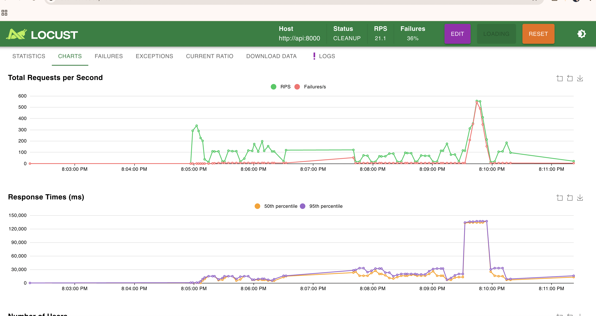
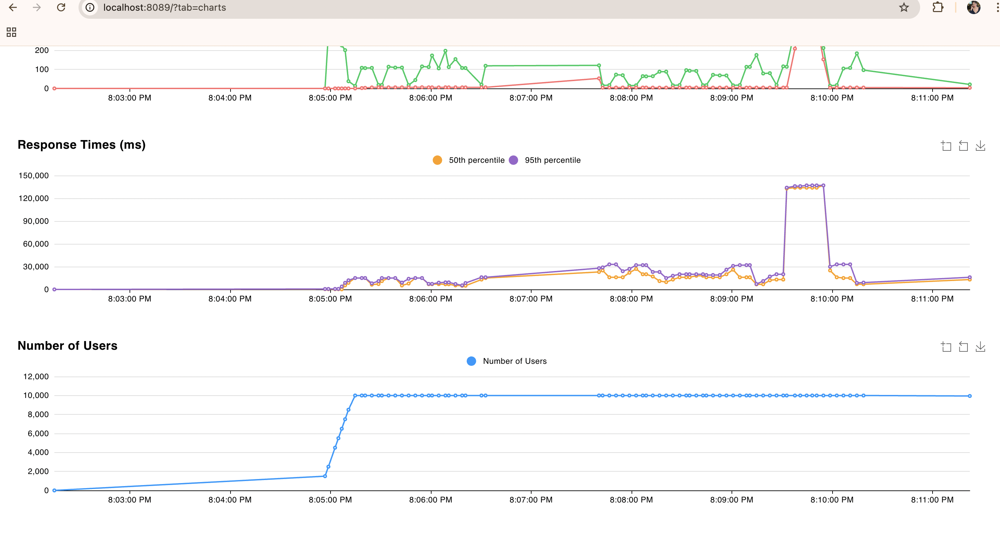
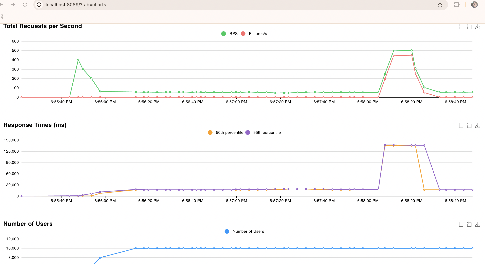
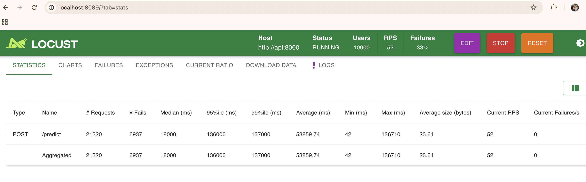
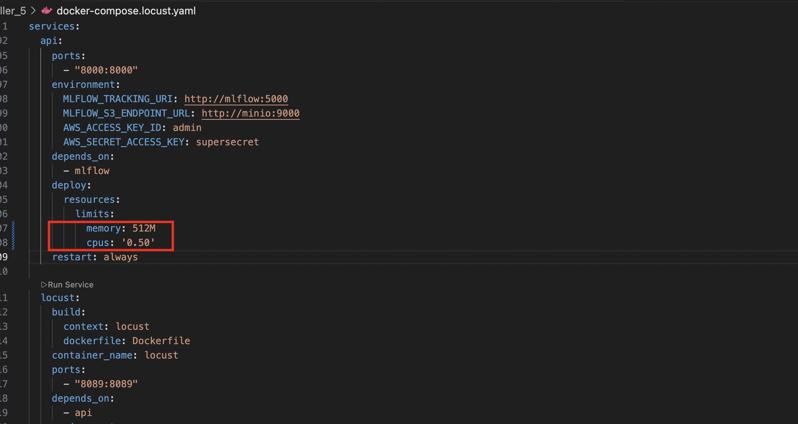
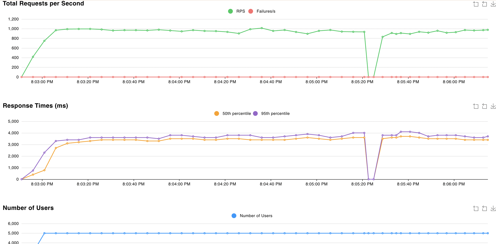
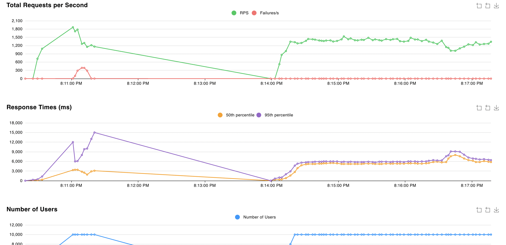
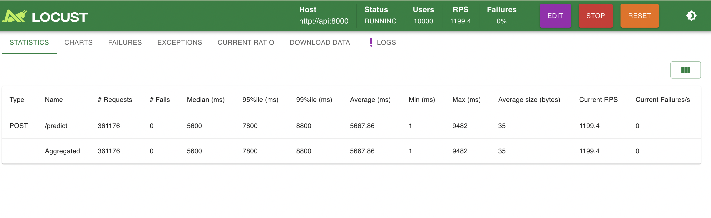

# Taller 5 - MLOps: Inferencia con Docker, Pruebas de Carga y Escalamiento

Este proyecto extiende el Taller 4 para publicar la API de inferencia como imagen Docker en DockerHub, realizar pruebas de carga con Locust y analizar el comportamiento bajo diferentes configuraciones de recursos y replicas.

## Diagrama del Sistema

```
┌──────────────────────────────────────────────────────────────────────────┐
│                         Docker Compose Network                          │
│                                                                         │
│  ┌──────────────┐    ┌──────────────┐    ┌──────────────────────────┐   │
│  │  PostgreSQL   │    │    MinIO      │    │       MLflow Server      │   │
│  │  (mlflow_db)  │◄───│  (artifacts) │◄───│   - Tracking URI         │   │
│  │  :5434        │    │  :9000/:9001 │    │   - Model Registry       │   │
│  │  Metadata     │    │  Bucket:     │    │   :5001                  │   │
│  └──────────────┘    │  mlflows3    │    └──────────┬───────────────┘   │
│                      └──────────────┘               │                   │
│                                                      │                   │
│         ┌────────────────────────────┬───────────────┘                   │
│         │                            │                                   │
│         ▼                            ▼                                   │
│  ┌──────────────┐    ┌──────────────────────────────────────────┐       │
│  │  JupyterLab  │    │          API de Inferencia (FastAPI)      │       │
│  │  :8888       │    │  Imagen: tannialucia/mlops:inference-api  │       │
│  │              │    │                                            │       │
│  │  Entrena y   │    │  ┌─────────┐ ┌─────────┐ ┌─────────┐    │       │
│  │  promueve    │    │  │Replica 1│ │Replica 2│ │Replica 3│    │       │
│  │  modelos     │    │  │512M/0.5C│ │512M/0.5C│ │512M/0.5C│    │       │
│  └──────┬───────┘    │  └─────────┘ └─────────┘ └─────────┘    │       │
│         │            │         DNS Round-Robin :8000             │       │
│         ▼            └──────────────────┬───────────────────────┘       │
│  ┌──────────────┐                       │                               │
│  │    MySQL      │               ┌──────┴───────┐                       │
│  │  (data_db)   │               │    Locust     │                       │
│  │  :3306       │               │  :8089        │                       │
│  └──────────────┘               │  Load Testing │                       │
│                                  └──────────────┘                       │
└──────────────────────────────────────────────────────────────────────────┘
```

## Descripcion del Proyecto

### 1. Infraestructura

| Servicio | Imagen | Proposito | Puerto |
|---|---|---|---|
| **mlflow_db** | postgres:15 | Metadata de MLflow | 5434 |
| **minio** | quay.io/minio/minio | Almacenamiento S3 para artefactos | 9000/9001 |
| **data_db** | mysql:8.0 | Datos del proyecto (penguins) | 3306 |
| **mlflow** | Custom (python:3.9-slim) | Tracking y Model Registry | 5001 |
| **jupyter** | jupyter/scipy-notebook | Entrenamiento y experimentacion | 8888 |
| **api** | tannialucia/mlops:inference-api | API de inferencia (desde DockerHub) | 8000 |
| **locust** | Custom (python:3.11-slim) | Pruebas de carga | 8089 |

### 2. Imagen de Docker publicada en DockerHub

La API de inferencia fue empaquetada como imagen Docker y publicada en DockerHub:

- **Imagen**: `tannialucia/mlops:inference-api`
- **Base**: `python:3.9-slim`
- **Dependencias**: FastAPI, uvicorn, MLflow, boto3, scikit-learn, pandas

La API carga automaticamente el modelo con alias `production` desde MLflow al iniciar.

### 3. Dos archivos Docker Compose

| Archivo | Proposito |
|---|---|
| `docker-compose.yaml` | Uso normal: levanta toda la infraestructura + API sin limites de recursos |
| `docker-compose.locust.yaml` | Pruebas de carga: agrega Locust, limites de recursos y soporte para replicas |

## Pruebas de Carga con Locust

### Busqueda de recursos minimos

Se probaron diferentes configuraciones de memoria y CPU para encontrar el minimo que permite a la API funcionar bajo carga de 10,000 usuarios concurrentes (spawn rate: 500/s).

| Configuracion | Arranque | Bajo carga (10k users) | Resultado |
|---|---|---|---|
| 100M / 0.25 CPU | OOM Kill | - | No arranca |
| 256M / 0.50 CPU | OOM Kill | - | No arranca |
| 300M / 0.50 CPU | OOM Kill | - | No arranca |
| 384M / 0.50 CPU | OK | OOM Kill (99.98% failures) | Se cae bajo carga |
| **512M / 0.50 CPU** | **OK** | **Funciona** | **Minimo viable** |

La API consume ~150MB solo al arrancar (MLflow client + scikit-learn + pandas + modelo). Bajo carga de 10,000 usuarios, la memoria sube a ~250MB, por lo que 384M no es suficiente y 512M es el minimo.

### Resultados: 1 replica SIN limites de recursos

Primero se probo la API sin ninguna restriccion de CPU ni memoria para establecer un baseline.




| Metrica | Valor |
|---|---|
| RPS | 21 |
| Failures | 36% |
| Response time P50 | ~30,000 ms |
| Response time P95 | ~130,000 ms |

Incluso sin limites, una sola instancia de uvicorn no puede manejar 10,000 usuarios concurrentes. El cuello de botella es el GIL de Python y el single-worker de uvicorn.

### Resultados: 1 replica con recursos minimos (512M / 0.5 CPU)

#### 10,000 usuarios concurrentes





| Metrica | Valor |
|---|---|
| Requests totales | 21,320 |
| Failures | 6,937 (33%) |
| RPS | 52 |
| Median response time | 18,000 ms |
| P95 response time | 136,000 ms |
| Max response time | 136,710 ms |

Con 1 replica limitada y 10,000 usuarios, el comportamiento es similar al baseline sin limites: la API no logra soportar la carga.

#### 5,000 usuarios concurrentes (maximo estable con 1 replica)



Con 5,000 usuarios la API se mantiene estable: ~1,000 req/s, 0% failures, ~3 segundos de response time. Este es el maximo de usuarios que soporta una sola instancia.

### Resultados: 3 replicas con recursos minimos (512M / 0.5 CPU cada una)




| Metrica | Valor |
|---|---|
| Requests totales | 361,176 |
| Failures | 0 (0%) |
| RPS | 1,199 |
| Median response time | 5,600 ms |
| P95 response time | 7,800 ms |
| Max response time | 9,482 ms |

Con 3 replicas la API soporta **10,000 usuarios concurrentes sin un solo failure**. Docker Compose distribuye las peticiones entre las 3 instancias via DNS round-robin.

## Analisis Comparativo

| Metrica | Sin limites (1x) | 1 Replica (512M/0.5CPU) | 3 Replicas (512M/0.5CPU c/u) |
|---|---|---|---|
| RPS | 21 | 52 | **1,199** |
| Failures | 36% | 33% | **0%** |
| Median response time | 30,000 ms | 18,000 ms | **5,600 ms** |
| P95 response time | 130,000 ms | 136,000 ms | **7,800 ms** |
| Usuarios maximos estables | ~5,000 | ~5,000 | **10,000+** |

## Respuestas a las Preguntas del Taller

### Es posible reducir mas los recursos?

**No.** 512M es el minimo absoluto. La API necesita ~150MB solo para arrancar (Python + MLflow + scikit-learn + pandas + modelo en memoria). Con 384M arranca pero bajo carga de 10,000 usuarios la memoria sube y el contenedor es terminado por OOM Kill. Con 256M o menos, ni siquiera logra iniciar.

### Cual es la mayor cantidad de peticiones soportadas?

- **1 replica**: ~1,000 req/s estables con 5,000 usuarios. Con 10,000 baja a 52 req/s con 33% de failures.
- **3 replicas**: **1,199 req/s** estables con 10,000 usuarios y 0% failures.

### Que diferencia hay entre una o multiples instancias?

Con **1 instancia**, toda la carga recae en un solo proceso Python (uvicorn single-worker). El CPU se satura al 100% del limite asignado y la memoria crece hasta hacer OOM. El cuello de botella es que Python tiene el GIL (Global Interpreter Lock), limitando el paralelismo real.

Con **3 instancias**, Docker Compose distribuye las peticiones entre los contenedores via DNS round-robin. Cada replica maneja ~1/3 de la carga, lo que permite:
- **3x capacidad de CPU** (cada replica tiene su propio core virtual)
- **3x capacidad de memoria** (cada replica tiene su propio espacio)
- **Tolerancia a fallos**: si una replica se cae, las otras siguen respondiendo

El escalamiento horizontal (mas replicas) es mas efectivo que el vertical (mas recursos por instancia) para APIs stateless como esta.

### Si no logra llegar a 10,000 usuarios, cual es la cantidad maxima alcanzada?

Con **1 replica** (512M / 0.5 CPU): el maximo estable es **~5,000 usuarios** (~1,000 req/s, 0% failures).

Con **3 replicas** (512M / 0.5 CPU cada una): se alcanzan los **10,000 usuarios** sin problemas (1,199 req/s, 0% failures).

## Estructura del Proyecto

```
Taller_5/
├── docker-compose.yaml              # Infraestructura + API (sin limites)
├── docker-compose.locust.yaml       # Infraestructura + API limitada + Locust
├── README.md
├── img/                             # Capturas de pruebas de carga
├── mlflow/
│   └── Dockerfile                   # MLflow server custom con psycopg2
├── notebooks/
│   ├── requirements.txt             # Dependencias del notebook
│   └── penguins_training.ipynb      # Entrenamiento y promocion de modelos
├── api/
│   ├── Dockerfile                   # Imagen de la API (publicada en DockerHub)
│   ├── requirements.txt             # Dependencias de la API
│   └── app.py                       # FastAPI: /predict, /health, /reload
└── locust/
    ├── Dockerfile                   # Imagen de Locust
    ├── requirements.txt             # Dependencia: locust
    └── locustfile.py                # Escenario de carga: POST /predict
```

## Pasos para Ejecutar

### 1. Iniciar Colima con 6GB de RAM

```bash
colima start --memory 6
```

### 2. Levantar infraestructura base y entrenar modelo

```bash
cd Taller_5
docker-compose up -d --build
```

Acceder a JupyterLab (http://localhost:8888), abrir `penguins_training.ipynb` y ejecutar todas las celdas para entrenar y promover el modelo a produccion.

### 3. Ejecutar pruebas de carga

```bash
docker-compose -f docker-compose.locust.yaml up -d --build
```

Abrir Locust en http://localhost:8089, configurar usuarios y spawn rate.

Monitorear recursos en otra terminal:

```bash
docker stats taller_5-api-1 taller_5-api-2 taller_5-api-3
```

### 4. Ajustar replicas

En `docker-compose.locust.yaml`, cambiar el numero de replicas:

```yaml
deploy:
  replicas: 3  # Cambiar segun necesidad
  resources:
    limits:
      memory: 512M
      cpus: '0.50'
```

Reiniciar:

```bash
docker-compose -f docker-compose.locust.yaml up -d
```

## Credenciales de Acceso

| Servicio | URL | Usuario | Contrasena |
|---|---|---|---|
| **MLflow UI** | http://localhost:5001 | — | — |
| **MinIO Console** | http://localhost:9001 | `admin` | `supersecret` |
| **JupyterLab** | http://localhost:8888 | — | Token (ver logs) |
| **API Swagger** | http://localhost:8000/docs | — | — |
| **Locust UI** | http://localhost:8089 | — | — |
| **PostgreSQL** | localhost:5434 | `mlflow` | `mlflow` |
| **MySQL** | localhost:3306 | `datauser` | `datapass` |

## Comandos Utiles

```bash
# Ver logs de la API
docker-compose -f docker-compose.locust.yaml logs --tail 30 api

# Ver estado de los contenedores
docker-compose -f docker-compose.locust.yaml ps

# Monitorear recursos en tiempo real
docker stats taller_5-api-1 taller_5-api-2 taller_5-api-3

# Verificar si un contenedor fue OOM-killed
docker inspect taller_5-api-1 --format='OOMKilled: {{.State.OOMKilled}}'

# Detener todos los servicios
docker-compose -f docker-compose.locust.yaml down

# Detener y eliminar volumenes
docker-compose -f docker-compose.locust.yaml down -v
```

## Tecnologias Utilizadas

- **FastAPI** — API REST de inferencia
- **MLflow 3.1.4** — Model Registry y tracking
- **Docker / Docker Compose** — Contenedorizacion y orquestacion
- **DockerHub** — Registro de imagen publicada (`tannialucia/mlops:inference-api`)
- **Locust** — Pruebas de carga
- **PostgreSQL 15** — Metadata de MLflow
- **MySQL 8.0** — Datos del proyecto
- **MinIO** — Almacenamiento S3 para artefactos
- **Scikit-learn 1.6.1** — Modelo de clasificacion (SVM)
- **Colima** — Runtime Docker en macOS
